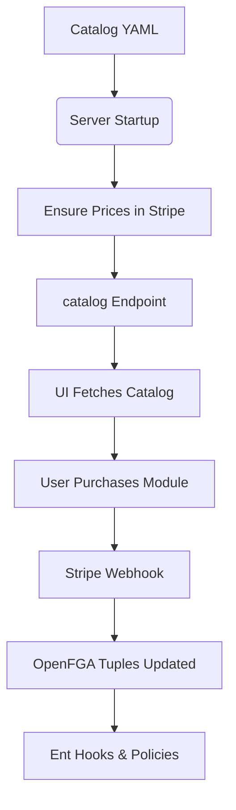
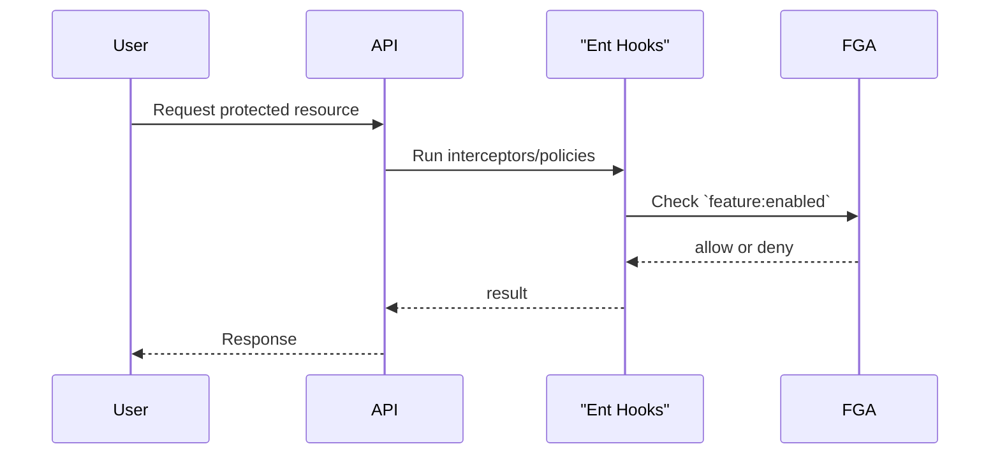

<div align="center">


[](https://goreportcard.com/report/github.com/theopenlane/core)
[](https://buildkite.com/theopenlane/core)
[](https://pkg.go.dev/github.com/theopenlane/core)
[](https://opensource.org/licenses/Apache-2.0)
[](https://sonarcloud.io/summary/new_code?id=theopenlane_core)

</div>

This repository houses the core server and orchestration elements which are at
the heart of the [Openlane](https://www.theopenlane.io) cloud service, which is targeted for public release towards mid-2025 - sign up for our [waitlist](https://console.theopenlane.io/waitlist) to get access! Our initial featureset includes:

- Creation of new programs that include pre-built templates, controls, risks, etc., for standards like SOC2, ISO27001, NIST800-53, and more
- Automated Task assignments and configurable workflows with task reminders and escalation
- Evidence upload, approval processes, and other configurable automation to get you through your audits
- Robust user and group management with a myriad of RBAC controls / toggles to ensure individuals in your company see what they are supposed to see
- Multiple authentication methods and organization-level controls for authorized domains (with organization-wide SSO coming soon!)
- Automated domain scanning with assets and other resources created automatically for your approval
- Questionnaire creation, customization, and automation for easier internal and external interactions with your staff, auditors, and vendors
- Notification customizations, channel definitions, comments and histories on all your objects
- Easy to use documentation editors and storage for Policies and Procedures, or whatever documentation is needed
.... and more!

We have our sights set on additional features such as:
- Trust Center and vanity domains
- Automated Evidence collection
- Continuous GRC features
- Vulnerability Management
- Source code scanning
- Internal training programs and tracking mechanisms

## Features

At it's core, this repo is a collection of services built on top of an entity
framework which allows us to:

- Model database schemas as graph structures
- Define schemas as programmatic go code
- Execute complex database queries and graph traversals easily
- Extend and customize using templates and code generation utilities
- Type-safe resolvers and GraphQL schema stitching
- Code generated audit / history tables for defined schemas

On top of this powerful core we also have an incredible amount of pluggable,
extensible services:

- Authentication: we today support password, OAuth2 / Social login providers
  (Github, Google), Passkeys as well as standard OIDC Discovery flows (NOTE: you will need to create your own github or google client secrets and leverage them to take advantage of this capability)
- Multi-factor: built-in 2FA mechanisms, TOTP
- Authorization: extensible and flexible permissions constructs via openFGA
  based on Google Zanzibar
- Session Management: built-in session management with JWKS key validation,
  encrypted cookies and sessions
- Robust Middleware: cache control, CORS, Rate Limiting, transaction rollbacks,
  and more
- Queuing and Scheduling: Task management and scheduling with
  [riverqueue](https://github.com/riverqueue/river)
- External Storage Providers: store data in AWS S3, Google GCS, or locally
- External Database Providers: Leverage NeonDB, or other PostgreSQL compatible
  vendors and libraries
- Data Isolation and Management: Hierarchal organizations and granular
  permissions controls

## Development

### Dependencies

The vast majority of behaviors of the system can be turned on or off by updating
the configuration parameters found in `config`; in some instances, we've made
features or integrations with third party systems which are "always on", but
we're happy to receive PR's wrapping those dependencies if you are interested in
running the software without them!

### Installing Dependencies

Setup [Taskfile](https://taskfile.dev/installation/) by following the
instructions and using one of the various convenient package managers or
installation scripts. After installation, you can then simply run `task install`
to load the associated dependencies. Nearly everything in this repository
assumes you already have a local golang environment setup so this is not
included. Please see the associated documentation.

### Updating Configuration Settings

See the [README](/config/README.md) in the `config` directory.

### Starting the Server

1. Copy the config, this is in .gitignore so you do not have to worry about
   accidentally committing secrets

   ```bash
   cp ./config/config-dev.example.yaml ./config/.config.yaml
   ```

1. Update the configuration with whatever respective settings you desire; the
   defaults inside should allow you to run the server without a problem

1. Use the task commands to start the server

   Run the core server in development mode with dependencies in docker

   ```bash
   task run-dev
   ```

   Run fully in docker

   ```bash
   task docker:all:up
   ```

1. In a separate terminal, with the server running, you can create a verified
   test user by running:

   ```bash
   task cli:user:all
   ```

1. Once this command has finished ^, you can login and perform actions as user
   `mitb@theopenlane.io` with password `mattisthebest1234`

### CSRF Tokens

The server enforces CSRF protection on all mutating requests. Clients must
include a valid token in the `X-CSRF-Token` header. Existing client code can
create a client with the CSRF Token using the following function. This function
will grab a valid CSRF token from the `/livez` endpoint  and send it for subsequent requests.

```go
 client.ClientWithCSRFToken(ctx, opts...)
```

You can also manually call `InitCSRF` on the client:

```go
ctx := context.Background()
if err := client.InitCSRF(ctx); err != nil {
    // handle error
}
```

The CLI has been updated to call `ClientWithCSRFToken` automatically, but other custom clients will need to adopt one of the approaches.

NOTE: Because the CSRF middleware stores the token only in the client’s cookie and not on the server, restarting the core server (or core server running in Kubernetes pods) does not invalidate the token. When the middleware receives a request, it checks the token in the `csrf_token` cookie against the `X-CSRF-Token` header. If the cookie is already present, that same token is used — no new token is generated. The token cookie persists until it expires (default 24h), so clients will continue to send the same value even if the server has restarted.

Therefore, rolling restarts on Kubernetes will not force new tokens to be issued and should not cause requests to fail, provided the client retains its CSRF cookie.

### Creating Queries in GraphQL

The best method of forming / testing queries against the server is to run
`task docker:rover` which will launch an interactive query UI.

If you are running the queries against your local repo, you will have CORS
issues using the local running apollo. Instead, its recommended to use the
[apollo sandbox](https://studio.apollographql.com/sandbox/explorer) and ensure
the following origin is allowed in your `config/.config.yaml`

```
server:
  cors:
    allowOrigins:
      - https://studio.apollographql.com
```

In the apollo settings you will need to configure your connection settings:
1. Endpoint: `http://localhost:17608/query`
1. Shared Headers: `Authorization` `Bearer tolp_REDCATED`

You can obtain a local personal access token or api token against your local api by running:

```
task cli:token:create
```

```
task cli:pat:create
```

These are also created automatically when you setup the test user using `task cli:user:all`

### OpenFGA Playground

You can load up a local openFGA environment with the compose setup in this
repository; `task fga:up` - this will launch an interactive playground where you
can model permissions model(s) or changes to the models

### Creating a new Schema

To ease the effort required to add additional schemas into the system a
template + task function has been created. This isn't doing anything terribly
complex, but it's attempting to ensure you have the _minimum_ set of required
things needed to create a schema - most notably: you need to ensure the IDMixin
is present (otherwise you will get ID type conflicts) and a standard set of
schema annotations.

NOTE: you still have to make intelligent decisions around things like the
presence / integration of hooks, interceptors, policies, etc. This is saving you
about 10 seconds of copy-paste, so don't over estimate the automation, here.

To generate a new schema, you can run `task newschema -- [yourschemaname]` where
you replace the name within `[]`. Please be sure to note that this isn't a
command line flag so there's a space between `--` and the name.

### Migrations

We use [atlas](https://atlasgo.io/) and
[goose](https://github.com/pressly/goose) to create and manage our DB
migrations - you can trigger one via `task atlas:create` and that will generate
the necessary migrations. There should be a new migration file created in
`db/migrations` and `db/migrations-goose-postgres`. On every PR, the Atlas
integration also creates comments with any issues related to the schema changes
/ migrations.

## Deploying

The only "supported" method of deploying today is locally, but we have a WIP
Helm chart which can be found [here](https://github.com/theopenlane/helm-charts)

## Contributing

See the [contributing](.github/CONTRIBUTING.md) guide for more information.

## UI

We have additionally open-sourced the [Openlane UI](https://github.com/theopenlane/openlane-ui) and you can run / use this technology locally (or host it on your own servers) but we have not undergone efforts to ensure things such as links to our Terms of Service or Privacy policy, or other prioritiary branding or assets owned by theopenlane, Inc., are fully configurable or removable.

### Module Catalog

Available modules and add-ons are defined in `config/catalog.example.yaml`.
The server loads this file at startup (see `moduleCatalogFile` in
`config/config.example.yaml`) and watches for changes. Updates to the file are
applied automatically without a restart.

The `/v1/catalog` endpoint exposes the visible catalog to the UI. The audience
field controls if a module is `public`, `beta`, or `private`.

Each feature's `billing.prices` section enumerates Stripe prices for that
feature. Prices are matched by interval, amount, nickname, lookup key, and
metadata rather than a fixed ID. During server startup (and whenever the catalog file is
reloaded) missing products and prices are created automatically and tagged with
`managed_by: module-manager` so they can be distinguished from manual entries.

Modules may define usage limits like `evidence_storage_gb` that grant resources
when the feature is enabled. Add-ons can extend these limits incrementally.

#### End‑to‑End Flow

The following diagram shows how modules flow from configuration to
authorization:



1. **Catalog YAML** defines modules, add‑ons and pricing.
2. On server startup the catalog is loaded and any missing Stripe prices are
   created.
3. `/v1/catalog` exposes the catalog so the UI can display purchasable modules.
4. When a module is purchased the Stripe webhook updates the organization’s
   feature tuples in openFGA.
5. Ent hooks and privacy rules consult these tuples to allow or deny access to
   functionality. Enabled features are cached in the same Redis instance used
   for session storage for five minutes to minimize calls to OpenFGA while
   keeping it as the source of truth.

You can verify your configuration without modifying Stripe by running
`go run ./cmd/catalogdryrun`. This CLI loads the catalog and reports which
products and prices already exist.  The catalog format itself is described by
`jsonschema/catalog.schema.json` so you can lint changes with any JSON Schema
validator.

### Why not store features in the session?

Storing feature data directly inside the session or embedding it into issued
JWTs might seem convenient, but it introduces significant lifecycle concerns.
Tokens often remain valid for hours or days; if a subscription changes during
that time the token would become stale until the user reauthenticates. By
keeping feature lists in their own Redis cache we can update entitlements
immediately while still sharing the same Redis infrastructure as the session
store. Sessions stay lightweight and users do not need to log back in when
their organization gains or loses modules.

### Feature Annotations

Ent schemas can optionally declare which modules enable their functionality
using annotations from `pkg/features`.  For example,
`features.Requires("compliance-module")` ties a schema to the compliance
module while `features.Base()` marks core or internal schemas that bypass module checks.
Multiple modules can be listed to allow access if *any* are enabled,
e.g. `features.Requires("compliance-module", "trust-center")`.
Policies and interceptors can inspect these annotations to enforce access.
Running `go generate ./internal/ent/generate` produces a `features_gen.go`
file inside `internal/ent/generated` mapping schemas to required modules. This
mapping can be imported by privacy rules or interceptors to apply checks based
on the annotations.

#### Entitlement Check Flow



## Sponsoring

If any of our code or projects have helped you or you just want to help us out, we massively appreciate a sponsorship on our github project of any level!
