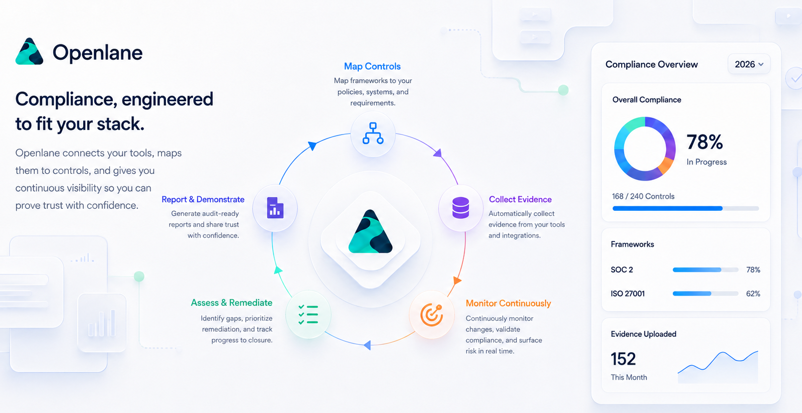

<div align="center">


[](https://buildkite.com/theopenlane/core?branch=main)
[](https://pkg.go.dev/github.com/theopenlane/core)
[](https://opensource.org/licenses/Apache-2.0)
[](https://sonarcloud.io/summary/new_code?id=theopenlane_core)

📚 [Documentation](https://docs.theopenlane.io) | 🚀 [Openlane Cloud](https://console.theopenlane.io/signup) | 🌎 [Website](https://www.theopenlane.io)

</div>

[Openlane](https://www.theopenlane.io) is one of the few, truly open-source compliance automation platforms - giving you a system of record for your compliance program including the people, systems, and vendors in scope; the policies and controls that govern them; and the evidence that proves it, and all with the automation to keep it current. This repository contains the core server and orchestration services behind the Openlane cloud service.

<div align="center">



</div>

## Features

The platform is organized into a handful of areas that build on each other:

* [Compliance management](https://docs.theopenlane.io/docs/platform/compliance-management/overview): policies, controls, evidence, and programs, with editors, approvals, comments, and full history on every object
* [Frameworks and standards](https://docs.theopenlane.io/docs/platform/standards/overview): importable control sets for SOC 2, ISO 27001, NIST 800-53, and more; one control can satisfy requirements across multiple frameworks
* [Registry](https://docs.theopenlane.io/docs/platform/registry/overview): automatically import your personnel and contractor lists from your directory, entities / vendors from your CRM, assets from your CMDB or spreadsheets, define platforms, vendor / 3d party contacts, and more.
* [Exposure](https://docs.theopenlane.io/docs/platform/exposure/overview): automated domain scanning, vulnerability integrations with GitHub, AWS Security Hub, and GCP Security Command Center (and more to come!) with remediation tracking to document fixes and update your risks
* [Automation](https://docs.theopenlane.io/docs/platform/automation/overview): integrate with the tools you already use like Google Drive, Github, Entra ID, AWS, GCP (and more!) with configurable workflows and approvals, email campaigns for bulk outreach, questionnaires and assessments for your vendors or employees, and task assignment with reminders and escalation
* [Trust Center](https://docs.theopenlane.io/docs/platform/trust-center/overview): a customizable, branded portal on your own domain publishing certifications, security documents, and subprocessors - reduce friction pre-sales and give your prospects and vendors one-stop shopping (check out [ours](https://trust.theopenlane.io))
* [Organization settings](https://docs.theopenlane.io/docs/platform/settings/overview): your tenant, your team, your data, with granular RBAC, billing, and the custom data that shapes how objects are classified
* [Integrations and security](https://docs.theopenlane.io/docs/platform/integrations/overview): multiple authentication methods, organization-wide SSO, 2FA enforcement, auditor roles and views, all available with any of our modules so you're never paywalled for basic security measures

On the roadmap:

- Automated evidence collection and checks + tests libraries
- Internal training programs / campaigns
- Additional integrations with ticketing systems, documentation repositories, directories, security scanners
- Vendor Risk Scoring + TPRM modules
- Additional OSCAL support

## Getting Started

The fastest way to use Openlane is [signing up for the cloud service](https://console.theopenlane.io/signup); free for the first 30 days, no credit card required. We built our product on the idea you should only pay for what you use, so no "tier" pricing - [you can buy just the modules your team needs](https://www.theopenlane.io/pricing), and we have multiple partner, referral, and startup programs. Reach out if you aren't sure: `info@theopenlane.io`

### Run It Yourself

With [Go](https://go.dev/), [brew](https://brew.sh/), [Task](https://taskfile.dev/), and [Docker](https://www.docker.com/) installed:

```bash
task install:all
task run-dev
```

The [Getting Started guide](https://docs.theopenlane.io/docs/developers/getting-started/overview) covers the full path: tooling and IDE setup, configuration, running the stack, creating a test user, CLI authentication, and querying the API. We're working to have published helm charts and other supported methods of deployment (and adoption + contribution from the community help drive that), but until then, you can find all required container images published to the GitHub container registry (see [Operations](https://docs.theopenlane.io/docs/developers/operations/overview#deployment)) and published artifacts on the releases page of this repo.

## Development

The Openlane founders have taken care to build our stack using other open-source tools and technologies so you don't need a dozen SaaS subscriptions to be able to run it; we used technologies like PostgreSQL, Redis, S3-compatible object storage (so you can leverage projects like Rook, Minio), [ent](https://entgo.io/), [gqlgen](https://gqlgen.com/), and [OpenFGA](https://openfga.dev/), among many others.

The [developer documentation](https://docs.theopenlane.io/docs/developers/overview) covers the day-to-day workflows:

* [Schema and codegen](https://docs.theopenlane.io/docs/developers/schema-and-codegen/graphql-and-codegen): creating schemas, code generation, and database migrations
* [Architecture](https://docs.theopenlane.io/docs/developers/architecture/overview): request lifecycle, the workflows engine, and the [multi-module repo structure](https://docs.theopenlane.io/docs/developers/schema-and-codegen/multi-module-structure)
* [Security](https://docs.theopenlane.io/docs/developers/security/overview): authentication, API tokens, and the authorization model
* [Operations](https://docs.theopenlane.io/docs/developers/operations/overview): configuration, secrets, and deployment; the full parameter list lives in the [configuration reference](https://docs.theopenlane.io/docs/developers/operations/configuration-reference)

## Security

Please do not file GitHub issues or post on our public forum for security vulnerabilities, as they are public!

Openlane takes security issues very seriously. If you have any concerns about Openlane or believe you have uncovered a vulnerability, please get in touch via the e-mail address security@theopenlane.io. In the message, try to provide a description of the issue and ideally a way of reproducing it. See [security policy](https://github.com/theopenlane/core?tab=security-ov-file) for more details.

## Licensing

This repository contains open source software that comprises the Openlane stack which is open source software under [Apache 2.0](LICENSE). Openlane's SaaS / Cloud Services are products produced from this open source software exclusively by theopenlane, Inc. This product is produced under our published commercial terms (which are subject to change). Any logos or trademarks in our repositories in [theopenlane](https://github.com/theopenlane) organization are not covered under the Apache License and are trademarks of theopenlane, Inc.

Others are allowed to make their own distribution of this software or include this software in other commercial offerings, but cannot use any of the Openlane logos, trademarks, cloud services, etc.

## Contributing

See the [contributing guide](.github/CONTRIBUTING.md) for how to get involved. If our code or projects have helped you, or you want to support the work, we appreciate sponsorship on our GitHub project at any level.
