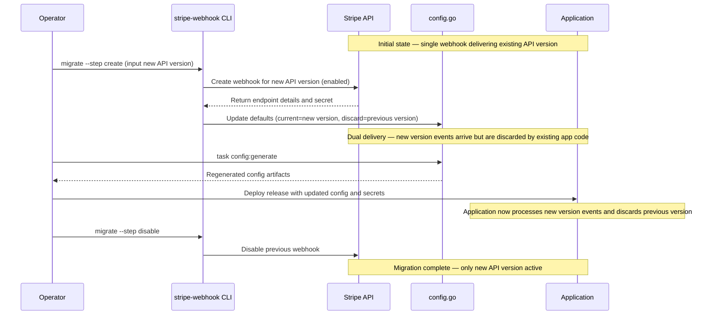

# Stripe Webhook Migration Tool

Automates zero-downtime Stripe webhook API version migrations using dual processing during deployment.

## How It Works

This tool enables safe migrations between Stripe API versions by temporarily running two webhooks simultaneously. In practice, the operator only needs to run three CLI commands—`stripe-webhook status`, `stripe-webhook migrate --step create`, and `stripe-webhook migrate --step disable`—alongside the standard `task config:generate` and deployment steps to complete the migration:



The migration uses query string parameters (`?api_version=X`) to distinguish webhooks, allowing the application to process events from the new version while safely discarding events from the old version during the transition.

## Prerequisites

```bash
export STRIPE_API_KEY=sk_test_...
export STRIPE_WEBHOOK_URL=https://api.theopenlane.io/v1/stripe/webhook
```

You can also pass `--stripe-key` and `--webhook-url` flags.

## Typical Migration Flow

1. **Inspect the current state**
   ```bash
   stripe-webhook status
   ```

2. **Create and enable the new webhook**
   ```bash
   stripe-webhook migrate --step create --webhook-url $STRIPE_WEBHOOK_URL
   ```

   Example session:
   ```text
   Preparing webhook migration for URL: https://api.theopenlane.io/v1/stripe/webhook
   Current webhook API version: 2023-10-16
   Latest Stripe SDK API version: 2024-06-20
   Enter the new Stripe API version to migrate to: 2024-06-20
   Proceed with migrating from 2023-10-16 to 2024-06-20 [y/N]: y

   Updated default API versions in /path/to/pkg/entitlements/config.go

   New webhook created (initially disabled)
   ID: we_123
   API Version: 2024-06-20
   Status: disabled
   Secret: whsec_xxx

   Store the secret above in your secret manager using the environment key CORE_SUBSCRIPTION_STRIPEWEBHOOKSECRETS_2024_06_20

   New webhook enabled successfully
   ID: we_123
   Status: enabled

   Next steps:
     1. Run `task config:generate` to refresh configuration artifacts with the new defaults.
     2. Commit the regenerated files (e.g., pkg/entitlements/config.go and config outputs).
     3. Populate CORE_SUBSCRIPTION_STRIPEWEBHOOKSECRETS_2024_06_20 in your secret manager before deploying the new code.
     4. Deploy code that accepts both API versions.
     5. After deployment, disable the legacy webhook:
        stripe-webhook migrate --step disable --webhook-url https://api.theopenlane.io/v1/stripe/webhook
   ```

   What happens:
   - The CLI updates `StripeWebhookAPIVersion` to the new version and `StripeWebhookDiscardAPIVersion` to the old version in `pkg/entitlements/config.go`
   - Creates a new webhook with the new API version (initially disabled)
   - Enables the new webhook for dual processing (both old and new webhooks are now active)
   - `task config:generate` will emit versioned environment variables for webhook secrets
   - Query parameters (`?api_version=X`) allow the handler to distinguish between webhook versions at runtime

3. **Deploy the code** with the updated config and new webhook secret loaded

   During deployment, both webhooks are active:
   - Old webhook sends events with `?api_version=2023-10-16` (discarded by handler based on config)
   - New webhook sends events with `?api_version=2024-06-20` (processed by handler)

4. **Disable the old webhook** after the new code is deployed and stable:
   ```bash
   stripe-webhook migrate --step disable --webhook-url $STRIPE_WEBHOOK_URL
   ```

   Output:
   ```text
   Disabling old webhook endpoint

   Old webhook disabled successfully
   ID: we_456
   Status: disabled

   Migration complete - only the new webhook is active
   ```

5. **Rollback (if needed before disabling old webhook)**
   ```bash
   stripe-webhook migrate --step rollback --webhook-url $STRIPE_WEBHOOK_URL
   ```
   - Disables the new webhook and re-enables the old one
   - Use this if issues are discovered during the dual processing phase

## Other Commands

- **List all webhooks**: `stripe-webhook list`
- **Automated guidance**: `stripe-webhook migrate --auto` executes the next eligible step or prints what to do
- **Non-interactive migration**: `stripe-webhook migrate --step create --new-version 2024-06-20`
- **Check migration status**: `stripe-webhook status --webhook-url $STRIPE_WEBHOOK_URL`

## Migration Stages

The tool tracks migration progress through these stages:

- `none`: No migration needed - webhook already matches current SDK version
- `ready`: Single enabled webhook, ready to start migration
- `new_created`: New webhook created but not yet enabled
- `dual_processing`: Both old and new webhooks enabled (safe to deploy)
- `complete`: Migration complete, only new webhook active (old webhook disabled)

## Notes

- **Webhook Identification**: The tool identifies webhooks purely by API version and status, regardless of total webhook count. Disabled webhooks from previous migrations are ignored.
- **Query Parameters**: All webhooks include the `?api_version=X` query parameter. The HTTP handler uses this to select the correct signing secret and to discard events from old versions during dual processing.
- **Safety Checks**: The disable command verifies that a new webhook is enabled before disabling the old one, preventing accidental service disruption.
- **Accumulated Webhooks**: Old webhooks remain disabled after migration rather than being deleted, accumulating over time.
- **Config Validation**: The CLI prevents setting current and discard versions to the same value and blocks reuse of versions already configured in `pkg/entitlements/config.go`.
- **Config Root**: Defaults to current directory; use `--config-root` when running from a subdirectory.
