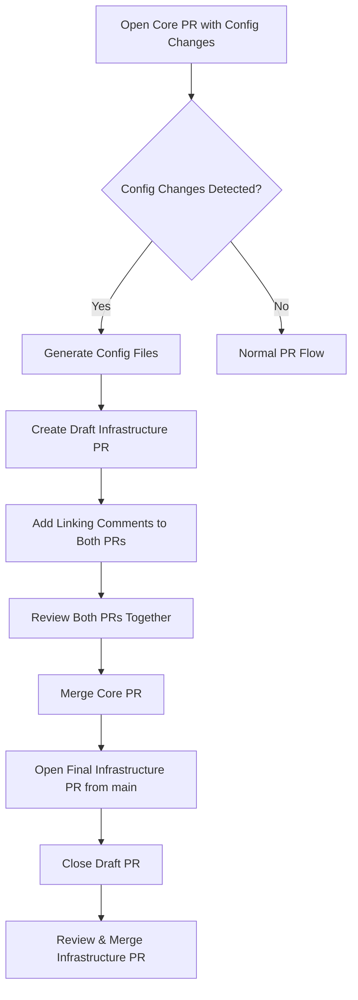

# Openlane Configuration

This directory contains the auto-generated configuration files and deployment automation resources for Openlane.

## Overview

The configuration system provides automated generation of Helm values from Go configuration structures. It bridges the gap between the core configuration repository and the deployment infrastructure (openlane-infra) by:

1. **Auto-generating Helm-compatible values** from Go struct definitions
2. **Omitting sensitive values** from generated Helm values (env examples keep variable names as placeholders)
3. **Automating pull request creation** when configuration changes
4. **Sending Slack notifications** for team awareness and approval workflows

## Generated Files

### Core Configuration Files

- **`helm-values.yaml`** - Complete Helm values with comments and schema annotations (sensitive fields are excluded)
- **`config.example.yaml`** - Example configuration file showing all available options
- **`configmap-config-file.yaml`** - Helm template that embeds a rendered `config.yaml` for pods to mount directly (preferred for Kubernetes deployments)

## How It Works

### 1. Configuration Detection

The system uses Go struct reflection to automatically detect:
- All configuration fields and their types
- Fields marked with `sensitive:"true"` tags
- JSON schema information and comments
- Default values and validation rules

### 2. Sensitive Field Processing

For each field tagged with `sensitive:"true"`:
- The value is **omitted** from generated `helm-values.yaml`
- The variable name still appears in `.env.example` as a placeholder
- You must provide the value at runtime via your preferred secret management approach

### 3. Dynamic Helm Integration

The generated `helm-values.yaml` includes only non-sensitive configuration values. Sensitive fields are excluded from Helm values and must be injected separately.

## Secret Management Workflow

### For DevOps/Infrastructure Teams

1. **Store sensitive values** in your preferred secret manager (Vault, SOPS, Kubernetes Secrets, etc.).
2. **Inject them at runtime** using your existing deployment workflow.

### For Development Teams

1. **Add sensitive fields** to Go structs with `sensitive:"true"` tags
2. **Run configuration generation** (happens automatically in CI/CD)
3. **Sensitive values are excluded** from generated Helm values

## Automation Pipeline

### Buildkite Integration

The `.buildkite/pipeline.yaml` includes a comprehensive helm automation step that:
1. **Generates configuration files** from Go structs using the schema generator
2. **Detects changes** in values or configmap templates
3. **Creates pull requests** in the openlane-infra repository with detailed change summaries
4. **Updates Helm chart versions** automatically (patch version increment)
5. **Sends Slack notifications** to alert teams when manual review is required

### Change Detection

The automation detects multiple types of changes:
- **Values Changes**: Updates to `values.yaml` with new configuration schema
- **ConfigMap Changes**: Updates to legacy configmap templates (backward compatibility)

### Slack Notification Integration

When helm chart PRs are created, the system sends rich Slack notifications with:

#### **Setup Requirements**

1. **Create a Slack Webhook**:
   - Go to your Slack workspace settings
   - Navigate to "Incoming webhooks"
   - Create a new webhook for your desired channel
   - Copy the webhook URL (format: `https://hooks.slack.com/services/...`)

2. **Configure Buildkite Secret**:
   ```bash
   # Add to your Buildkite cluster secrets
   SLACK_WEBHOOK_URL=https://hooks.slack.com/services/YOUR/WEBHOOK/URL
   ```

#### **Notification Features**

- **Rich formatting** with headers, sections, and action buttons
- **Change summaries** showing exactly what was updated
- **Direct links** to the PR for review and build details
- **Build context** including triggering user, branch, and build number
- **Next steps guidance** for team members

#### **Sample Notification**

```
🤖 Helm Chart Update Required

A new PR has been created that updates the Helm chart configuration and needs review before deployment.

Changes Made:
✅ Updated Helm values.yaml
📈 Bumped chart version to 1.2.34

Build: 1234 | Source Branch: feat-new-config
Pipeline: core | Triggered by: developer@company.com

Next Steps:
• Review the PR for configuration changes
• Approve and merge to enable deployment
• Contact DevOps if you have questions

[📋 Review PR] [🔍 Build Details]
```

#### **Configuration Options**

- **Webhook-based**: No need for Slack app tokens or complex OAuth setup
- **Automatic detection**: Only sends notifications when PRs are actually created
- **Graceful fallback**: Silently skips notifications if webhook URL is not configured

## Configuration Schema

### Helm Values Structure

All generated values include:
- **Comments**: Extracted from Go struct comments using `# --` format
- **Schema Annotations**: Type information using `# @schema` format
- **Default Values**: Automatically populated from struct defaults
- **Validation**: Type constraints and validation rules

## Security Considerations

1. **Separation of Concerns**: Sensitive values are never stored in plain text in the Helm chart; `.env.example` contains placeholders only
2. **Secret Store Agnostic**: Provide sensitive values via your preferred secret management system

## Troubleshooting

### Common Issues

1. **Missing Sensitive Values**: Check that fields are tagged with `sensitive:"true"`
2. **Schema Validation**: Check that schema annotations match field types

### Regenerating Configuration

To manually regenerate all configuration files:
```bash
cd /path/to/core
go run ./jsonschema/schema_generator.go
```

## Development

### Adding New Sensitive Fields

1. Add `sensitive:"true"` tag to the Go struct field:
   ```go
   type Config struct {
       APIKey string `json:"apiKey" sensitive:"true"`
   }
   ```

2. Run the generator or let CI/CD handle it automatically

3. The field will be omitted from generated `helm-values.yaml` and must be provided via your secret management workflow.

## Local Development Configuration

You will need to perform a 1-time action of creating a `.config.yaml` file based on the `.example` files.
The Taskfiles will also source a `.dotenv` files which match the naming conventions called for `{{.ENV}}` to ease the overriding of environment variables. These files are intentionally added to the `.gitignore` within this repository to prevent you from accidentally committing secrets or other sensitive information which may live inside the server's environment variables.

All settings in the `yaml` configuration can also be overwritten with environment variables prefixed with `CORE_`. For example, to override the Google `client_secret` set in the yaml configuration with an environment variable you can use:

```
export CORE_AUTH_PROVIDERS_GOOGLE_CLIENTSECRET
```

Configuration precedence is as follows, the latter overriding the former:

1. `default` values set in the config struct within the code
1. `.config.yaml` values
1. Environment variables

### Token key configuration

JWT signing keys are provided via the `token.keys` map. Each entry maps a ULID
(`kid`) to the path of a PEM encoded RSA private key. Keys can also be supplied
through the environment variable `CORE_AUTH_TOKEN_KEYS` using a comma separated
list in the form `kid=/path/key.pem`. When running inside Kubernetes you can
mount a secret containing one or more PEM files and set
`CORE_AUTH_TOKEN_KEYDIR` to the mount path to automatically load all keys from
that directory. When `CORE_AUTH_TOKEN_KEYDIR` is set the server also watches the
directory for changes and reloads the key set without needing a restart.

To rotate keys, create a new PEM file with a new ULID in the directory or update
the `CORE_AUTH_TOKEN_KEYS` variable with the additional entry. Keep the previous
key until all issued tokens expire.

### Global Domain Inheritance System

The `domain` setting provides a powerful global override system for domain-related configuration across all modules. This system automatically handles domain inheritance with support for prefixes and suffixes.

#### How Domain Inheritance Works

1. **Global Domain Configuration**: Set `CORE_DOMAIN` environment variable or `domain` in the YAML file
2. **Automatic Field Detection**: Any field tagged with `domain:"inherit"` will automatically inherit the global domain
3. **Prefix/Suffix Support**: Fields can specify domain prefixes and suffixes for automatic URL construction
4. **Runtime and Deployment**: Works both at Go runtime and in Kubernetes/Helm deployments

#### Domain Struct Tag Syntax

```go
type Config struct {
    // Basic domain inheritance
    SessionDomain string `json:"sessionDomain" domain:"inherit"`

    // With prefix - becomes "https://api.yourdomain.com"
    APIEndpoint string `json:"apiEndpoint" domain:"inherit" domainPrefix:"https://api"`

    // With suffix - becomes "yourdomain.com/.well-known/jwks.json"
    JWKSEndpoint string `json:"jwksEndpoint" domain:"inherit" domainSuffix:"/.well-known/jwks.json"`

    // With both prefix and suffix - becomes "https://api.yourdomain.com/v1/webhook"
    WebhookURL string `json:"webhookURL" domain:"inherit" domainPrefix:"https://api" domainSuffix:"/v1/webhook"`

    // Multiple prefixes for slice fields - becomes ["https://console.yourdomain.com", "https://docs.yourdomain.com"]
    AllowedOrigins []string `json:"allowedOrigins" domain:"inherit" domainPrefix:"https://console,https://docs"`
}
```

#### Automatic Code Generation

When you add fields with `domain:"inherit"` tags, the schema generator automatically creates:

1. **Go Runtime Logic**: The `applyDomain()` function processes these fields at startup
2. **Helm Templates**: Conditional logic in `configmap-config-file.yaml` for Kubernetes deployments
3. **Values Documentation**: Proper comments and schema annotations in helm-values.yaml

#### Example Generated Helm Template

For a field with domain inheritance, the rendered `config.yaml` block looks like:
```yaml
subscription:
  enabled: {{ default false .Values.openlane.coreConfiguration.subscription.enabled }}
  {{- if .Values.openlane.coreConfiguration.subscription.stripeWebhookURL }}
  stripeWebhookURL: {{ .Values.openlane.coreConfiguration.subscription.stripeWebhookURL | quote }}
  {{- else if .Values.domain }}
  stripeWebhookURL: "https://api.{{ .Values.domain }}/v1/stripe/webhook"
  {{- else }}
  stripeWebhookURL: "https://api.theopenlane.io/stripe/webhook"
  {{- end }}
```

#### Configuration Precedence

Domain inheritance follows this precedence order:
1. **Explicit field value** (highest priority)
2. **Global domain + prefix/suffix** (if domain is set)
3. **Default value** (lowest priority)

#### Usage Examples

**Setting Global Domain:**
```bash
# Environment variable
export CORE_DOMAIN=theopenlane.io

# Or in .config.yaml
domain: theopenlane.io
```

**Automatic Field Population:**
- `SessionDomain` → `theopenlane.io`
- `APIEndpoint` → `https://api.theopenlane.io`
- `JWKSEndpoint` → `theopenlane.io/.well-known/jwks.json`
- `WebhookURL` → `https://api.theopenlane.io/v1/webhook`
- `AllowedOrigins` → `["https://console.theopenlane.io", "https://docs.theopenlane.io"]`

#### Adding New Domain Fields

To add a new domain-inherited field:

1. **Add the struct tag** to your Go configuration:
   ```go
   NewEndpoint string `json:"newEndpoint" koanf:"newEndpoint" default:"https://old.example.com" domain:"inherit" domainPrefix:"https://newapi" domainSuffix:"/v2"`
   ```

2. **Regenerate configuration** (automatic in CI/CD):
   ```bash
   go run ./jsonschema/schema_generator.go
   ```

3. **The system automatically**:
   - Detects the new field during schema generation
   - Adds runtime domain application logic
   - Generates appropriate Helm template conditionals
   - Updates documentation and schema annotations

#### Benefits

- **Centralized Domain Management**: Change one setting to update all related URLs
- **Environment-Specific Deployments**: Easy switching between dev/staging/prod domains
- **Automatic URL Construction**: No manual string concatenation needed
- **Deployment Flexibility**: Works in both Go applications and Kubernetes deployments
- **Future-Proof**: New fields automatically inherit the system behavior

This system eliminates the need to manually configure dozens of domain-related settings across different modules and deployment environments.

## Intelligent Helm Values Merging

The automation system now includes intelligent merging capabilities to preserve existing Kubernetes-specific configurations while updating core application settings.

### How It Works

Instead of overwriting the entire `values.yaml` file, the system:

1. **Extracts Core Configuration**: Pulls the `core` section from generated values
2. **Preserves Kubernetes Config**: Maintains existing deployment, service, ingress, and other K8s settings
3. **Maintains Structure**: Keeps all non-core sections intact

### Merge Strategy

```bash
# Before (would clobber everything)
cp generated-values.yaml target-values.yaml

# After (intelligent merging)
yq eval '. as $target | load("generated-core.yaml") as $core | $target | .core = $core' target-values.yaml
```

### What Gets Merged vs Preserved

**Merged Sections** (replaced with generated content):
- `core.*` - All application configuration

**Preserved Sections** (maintained from existing values):
- `replicaCount` - Pod replica configuration
- `image.*` - Container image settings
- `service.*` - Kubernetes service configuration
- `ingress.*` - Ingress/networking configuration
- `resources.*` - Resource limits and requests
- `nodeSelector.*` - Node scheduling preferences
- `tolerations.*` - Pod scheduling tolerations
- `affinity.*` - Pod affinity rules
- Custom organizational settings

### Example Merge Result

**Original values.yaml:**
```yaml
replicaCount: 3
image:
  repository: ghcr.io/org/app
  tag: "v1.2.3"
service:
  type: ClusterIP
  port: 80
core:
  app:
    name: "old-app"
    version: "1.0.0"
```

**Generated values:**
```yaml
core:
  app:
    name: "new-app"
    version: "2.0.0"
  database:
    host: "db.example.com"
```

**Merged result:**
```yaml
replicaCount: 3              # Preserved
image:                       # Preserved
  repository: ghcr.io/org/app
  tag: "v1.2.3"
service:                     # Preserved
  type: ClusterIP
  port: 80
core:                        # Merged from generated
  app:
    name: "new-app"
    version: "2.0.0"
  database:
    host: "db.example.com"
```

## Automation Testing

The helm automation includes comprehensive testing capabilities to validate functionality without running the full CI/CD pipeline.

### Test Script Usage

```bash
# Run all tests
./.buildkite/test-helm-automation.sh full-test

# Test syntax and logic without external calls
./.buildkite/test-helm-automation.sh dry-run

# Test with local repository (most comprehensive)
./.buildkite/test-helm-automation.sh local-repo --verbose

# Test Slack webhook functionality
SLACK_WEBHOOK_URL=https://hooks.slack.com/... ./.buildkite/test-helm-automation.sh webhook-test

# Keep test files for debugging
./.buildkite/test-helm-automation.sh local-repo --no-cleanup
```

### What Gets Tested

**Dry Run Tests:**

- Script syntax validation
- Function definition checks
- Environment variable handling

**Local Repository Tests:**

- Complete merge functionality
- Values preservation logic
- External secrets integration
- Change detection algorithms

**Chart Versioning Tests:**

- Automatic version increment
- Changelog generation
- Git operations

**Webhook Tests:**

- Slack notification formatting
- Error handling
- Message delivery

### Test Environment

The test script creates a complete mock environment including:
- Temporary Git repositories
- Mock configuration files
- Simulated Buildkite environment variables
- Sample Helm charts with existing configurations

### Debugging Failed Tests

```bash
# Run with verbose output
./.buildkite/test-helm-automation.sh local-repo --verbose --no-cleanup

# Check test artifacts
ls -la /tmp/test-*

# Inspect generated files
cat /tmp/test-*/target-repo/charts/*/values.yaml
cat /tmp/test-*/target-repo/charts/*/CHANGELOG.md
```

### Continuous Improvement

The test suite validates:
- ✅ Configuration merging preserves Kubernetes settings
- ✅ Domain inheritance works correctly
- ✅ Chart versions increment automatically
- ✅ Changelogs capture all changes
- ✅ Slack notifications include relevant details
- ✅ Error conditions are handled gracefully

This testing framework ensures the automation remains reliable as the configuration system evolves.

## Draft PR Workflow for Configuration Changes

The system now includes an intelligent draft PR workflow that provides full visibility into configuration changes before they're merged, solving the development loop problem where you can't see the impact of core changes on infrastructure configuration until after merge.

### How It Works

When a PR is opened in the core repository with changes that affect configuration files, the system automatically:

1. **Detects Configuration Changes**: Monitors changes to `config/`, `pkg/objects/config.go`, and other configuration-related files
2. **Creates Draft PR**: Automatically creates a **DRAFT** PR in the openlane-infra repository showing the exact configuration changes
3. **Links PRs**: Adds comments to both PRs linking them together for easy navigation
4. **Opens Final PR on Main**: After the core PR is merged, the main-branch automation opens the final infrastructure PR
5. **Closes Draft PRs**: Post-merge automation closes any draft PRs tied to merged core PRs

### Workflow Diagram



### Benefits

#### Before (Problem)
- ❌ Core changes merged without seeing infrastructure impact
- ❌ Bad development loop: merge first, see problems later
- ❌ Configuration issues discovered during deployment
- ❌ Difficult to review configuration changes in isolation

#### After (Solution)

- ✅ Full visibility into configuration changes before merge
- ✅ Review both core and infrastructure changes together
- ✅ Catch configuration issues early in the review process
- ✅ Intelligent merging preserves existing Kubernetes settings

### Example Workflow

#### 1. Developer Opens Core PR

```bash
# Developer modifies configuration
git checkout -b feature/add-redis-config
# Edit pkg/objects/config.go to add Redis configuration
git commit -m "Add Redis caching configuration"
git push origin feature/add-redis-config
gh pr create --title "Add Redis caching support"
```

#### 2. Automatic Draft PR Creation

The system detects config changes and automatically:
- Creates `draft-core-pr-123-456` branch in openlane-infra
- Generates draft PR with merged configuration changes
- Preserves existing Kubernetes settings (replicas, images, etc.)
- Shows only the new Redis configuration

#### 3. PR Linking Comments

**Core PR Comment:**
```markdown
## 🔗 Related Infrastructure Changes

A draft PR has been automatically created in the infrastructure repository:

**🚧 Draft Infrastructure PR:** https://github.com/theopenlane/openlane-infra/pull/789

### 📋 Review Process

1. Review both PRs together - The draft PR shows exactly what configuration changes will be applied
2. Merge this core PR first - The draft PR will be closed and a new infra PR will be opened from `main`
3. Review and merge the infrastructure PR - Complete the deployment of configuration changes
```

**Infrastructure PR Comment:**

```markdown
## 🔗 Related Core Changes

This draft PR shows configuration changes from:

**📝 Source Core PR:** https://github.com/theopenlane/core/pull/123

### ⚠️ Important Notes

- **This is a DRAFT PR** - Do not merge until the core PR is merged first
- **Review both PRs together** - This shows the configuration impact of the core changes
- **Post-merge cleanup** - This draft PR will be closed after core PR merge
```

#### 4. Silent Draft Creation

Draft PRs are created silently without Slack notifications to avoid noise. The system focuses on notifying teams only when action is required.

#### 5. Post-Merge Automation & Notification

After core PR merge:
- Main branch automation opens a new infrastructure PR with final configuration changes
- Chart version incremented
- Draft PRs are automatically closed
- **Slack notification sent** - Infrastructure team notified that a new infra PR is ready for review

**Slack Notification Example:**

```
🤖 Helm Chart Update Required

A configuration PR has been finalized and is ready for infrastructure team review and deployment.

Core PR: #123 (Merged)
Infrastructure PR: Review

Changes Made:
- 🔄 Merged Helm values.yaml
- 📈 Bumped chart version to 1.2.4

Next Steps:
• Review the infrastructure PR
• Approve and merge to deploy changes
• Monitor deployment for any issues
```

### Configuration Change Detection

The system triggers draft PR creation for changes to:

**Direct Configuration Files:**

- `config/helm-values.yaml`
- `config/configmap-config-file.yaml`

**Configuration Source Files:**

- `pkg/objects/config.go`
- `internal/ent/entconfig/config.go`
- `pkg/entitlements/config.go`
- `pkg/middleware/cors/cors.go`
- Schema generator changes

**Generated Files (after running config generation):**

- `jsonschema/core.config.json`
- Any files with domain inheritance tags

### Testing the Draft PR Workflow

```bash
# Test draft PR workflow syntax and logic
./.buildkite/test-helm-automation.sh draft-pr

# Test complete workflow including merging
./.buildkite/test-helm-automation.sh full-test

# Test with verbose output for debugging
./.buildkite/test-helm-automation.sh draft-pr --verbose --no-cleanup
```

### Slack Notification System

The automation uses external message templates for consistent, maintainable notifications:

#### Message Templates

- **`helm-update-notification.json`** - Sent when infrastructure PRs are ready for review (AKA PR's against a helm chart for image bumps)
- **`pr-ready-notification.json`** - Reserved for optional draft-related notifications (currently unused)

#### Template System
```bash
# Templates use {{VARIABLES_ARE_SO_KEWL}} substitution
{
  "text": "🤖 Helm Chart Update Required",
  "blocks": [
    {
      "type": "section",
      "text": {
        "type": "mrkdwn",
        "text": "*Changes Made:*{{CHANGE_SUMMARY}}"
      }
    }
  ]
}
```

#### Notification Strategy

- **Silent Drafts**: Draft PR creation doesn't send notifications (reduces noise)
- **Ready Notifications**: Only notify when PRs need actual review/action
- **Template-Based**: All messages use external JSON templates for consistency
- **Variable Substitution**: Templates support dynamic content injection

### Customizing the Workflow

#### Skip Draft PR Creation

To skip draft PR creation for a specific PR, add to the commit message:
```
[skip-draft-pr] Add non-configuration changes

This change doesn't affect configuration so skip the draft PR workflow.
```

#### Force Draft PR Creation

To force draft PR creation even for minor changes:
```
[force-draft-pr] Update configuration comments

Even though this is a minor change, create a draft PR to show the impact.
```

#### Customize Slack Messages

Edit the template files in `.buildkite/templates/`:
```bash
# Edit notification templates
vim .buildkite/templates/helm-update-notification.json

# Test changes
./.buildkite/test-helm-automation.sh webhook-test
```

### Troubleshooting

#### Draft PR Not Created

Check if:
- Configuration files were actually changed
- The build pipeline completed successfully
- GitHub token has permissions to create PRs in the infrastructure repository

#### Draft PR Not Closing

Check if:
- The core PR was actually merged (not just closed)
- The post-merge automation step ran successfully
- The draft PR still exists and hasn't been manually modified

#### Configuration Changes Not Applied

Check if:
- The `config:ci` task completed successfully
- Generated files were committed to the core repository
- The draft PR shows the expected changes

### Pipeline Integration

The draft PR workflow integrates with the existing Buildkite pipeline:

**For Pull Requests:**

1. `generate_config` - Generate configuration files
2. `draft_pr_automation` - Create draft infrastructure PR
3. `link_pr_automation` - Link PRs with comments
4. Regular tests and builds continue

**For Main Branch (after merge):**

1. `generate_config` - Regenerate final configuration
2. `helm_automation` - Update infrastructure repository
3. `post_merge_automation` - Close draft PRs tied to merged core PRs

This workflow ensures that configuration changes are fully visible and reviewable before they impact production deployments, eliminating the bad development loop where issues are discovered after merge.
