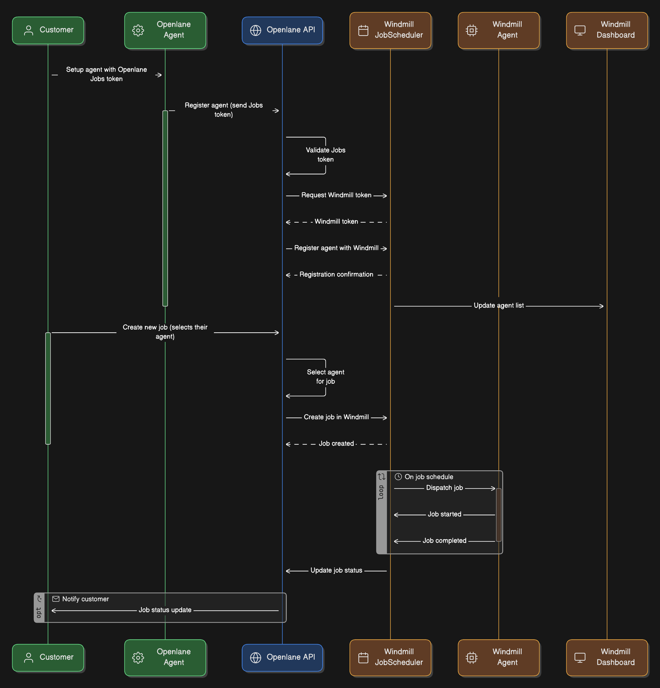

# Compliance Automation Jobs

## Overview

The compliance automation job system is built on top of [Windmill](https://windmill.dev/) and consists of several key components that work together to enable automated compliance checks and tasks. The system is designed to be flexible, scalable, and integrated with the organization's compliance framework.



The architecture diagram above illustrates the key components and their relationships:

1. **Job Templates** form the foundation of the system, defining reusable job definitions that include:
   - Script source and platform
   - Default configurations
   - Base schedules
   These templates are stored in both the core database and Windmill as flows.

2. **Scheduled Jobs** are instances created from templates that:
   - Reference a specific Job Template
   - Can override configurations and schedules
   - Can be linked to specific Job Runners
   - Are synchronized with Windmill's scheduler

3. **Job Runners** are execution environments that:
   - Authenticate using Job Runner Tokens
   - Execute jobs based on their assigned schedules
   - Report execution status and results back to the system

4. **Job Results** capture execution outcomes:
   - Link back to the Scheduled Job
   - Store execution metrics (start/end times, exit codes)
   - Maintain references to output files and logs
   - Track success/failure status

The system maintains bidirectional synchronization with Windmill, ensuring that job definitions, schedules, and results are consistent across both platforms.

## Components

### Job Templates

Job Templates (`JobTemplate`) are the core objects that define the jobs available for compliance automation. Each Job Template stores all the necessary information to run a job:

- **Title**: A human-readable name for the job
- **Description**: A description of what the job does
- **Platform**: The runtime environment or language for the script (e.g., `golang`, `typescript`, etc.)
- **Download URL**: A URL pointing to the raw script source, which can be fetched and wrapped into a Windmill flow
- **Windmill Path**: The internal path in Windmill where the job's flow is stored (not exposed via GraphQL API) and include the organizations name is the path folder
- **Configuration**: Optional JSON configuration that can be used to template the job
- **Cron Schedule**: Optional default cron schedule (6-field syntax) used when creating scheduled jobs

When a Job Template is created or updated:
1. The system validates the information
2. If Windmill integration is enabled, creates/updates a corresponding Windmill flow
3. The flow path is stored on the template for future reference

### Scheduled Jobs

Scheduled Jobs (`ScheduledJob`) are instances of Job Templates configured to run on a schedule. They represent the actual jobs that will be executed in your environment. Key fields include:

- **Job Template ID**: Reference to the Job Template being scheduled
- **Active**: Whether the job is currently active
- **Configuration**: Optional JSON configuration that overrides the template's configuration
- **Cron Schedule**: Optional cron expression (6-field syntax) that overrides the template's schedule
- **Job Runner ID**: Optional reference to a specific runner that should execute this job

### Job Runners

Job Runners (`JobRunner`) are the execution environments where jobs run. They can be organization-specific or shared runners. Key fields include:

- **Name**: Human-readable name for the runner
- **Status**: Current status (ONLINE/OFFLINE)
- **IP Address**: The runner's IP address (immutable and unique)
- **Organization**: The organization that owns this runner (if organization-specific)

### Job Runner Tokens

Job Runner Tokens (`JobRunnerToken`) are used to authenticate and authorize job runners. These tokens are essential for secure communication between runners and the core system. Each token includes:

- **Token**: A unique, immutable string prefixed with "runner_" (automatically generated)
- **Expiration**: Optional expiration time (tokens don't expire by default)
- **Last Used**: Timestamp of the token's last usage
- **Status**:
  - **Is Active**: Whether the token is currently active
  - **Revoked At**: When the token was revoked (if applicable)
  - **Revoked By**: User who revoked the token
  - **Revoked Reason**: Reason for revocation

Key features:
- Tokens are organization-scoped
- Each token is linked to a specific job runner
- Tokens can be revoked at any time
- Activity tracking through last_used_at field
- Support for token expiration (optional)

Security considerations:
- Tokens are immutable once created
- Revoked tokens cannot be reactivated
- Token validation checks for expiration and active status
- Organization-level access control

### Job Results

Job Results (`JobResult`) track the execution outcomes of scheduled jobs. Each result includes:

- **Scheduled Job ID**: Reference to the executed job
- **Status**: Execution status (SUCCESS/FAILED/PENDING/CANCELED)
- **Exit Code**: The script's exit code (if applicable)
- **Started At**: When the job started executing
- **Finished At**: When the job finished executing
- **File ID**: Reference to output/logs file
- **Organization**: The organization that owns this result

## Setup Dev Environment

1. Run `task docker:windmill` to startup windmill, this will start the minimum set of components. If you want all the extra components you can run `task docker:windmill:full` to start everything in the compose file
2. Copy the windmill example config and add the license keys
    ```bash
    cp docker/configs/windmill/.env-example docker/configs/windmill/.env
    ```
3. Get a [token](http://localhost:8090/workspace_settings#user-settings) from user settings
4. Ensure the following settings are in your `.config.yaml`
    ```yaml
    entConfig:
        windmill:
            enabled: true
            baseURL: "http://localhost:8090"
            workspace: "test"
            token: "" # get a token from windmill after it starts up from user settings and add here
            defaultTimeout: "30s"
            onFailureScript: ""
            onSuccessScript: ""
    ```
5. Run the normal `task run-dev` to setup the core api
6. From `core-startup` run the following to seed some test job templates and scheduled jobs:
    ```bash
    task feeling:lucky
    task startup:create:jobs
    ```

## Job Execution Flow

1. When a Scheduled Job's cron schedule triggers:
   - Windmill initiates the job execution
   - The job is assigned to a runner (specific or general pool)
   - The job status is set to PENDING

2. During execution:
   - The runner executes the job's script
   - (TODO) Output and logs are captured
   - (TODO) Start time is recorded

3. (TODO) After execution:
   - End time is recorded
   - Exit code is captured
   - Status is updated (SUCCESS/FAILED)
   - Results are stored in the job_results table
   - Output/logs are stored and linked via file_id

## Overall TODOs

- Results need to be posted back to the openlane API to the job results table
    - Add success and failure scripts that can be used in both dev + production
    - Fix the API because the syntax is incorrect and they aren't being added correctly - works currently with the script names set to empty in config
- Allow for other triggers (e.g. webhooks) instead of always running on a schedule
- Openlane agent wrapper for running on customers infra - should include a binary + docker image for both arm + x86 arch; no work has been done around agent creation and token exchange with the job runner tokens
- Add priority field to scheduled job, allow customers to prioritize certain jobs higher than others
- Add hook to disable a scheduled job - added field as `active` in the db, but its not currently passed to windmill and no update of scheduled jobs happens
- Test update paths for job templates + schedules in windmill, only creation has been tested
- Test deletion path + add hooks to ensure templates + schedules get deleted from windmill if they are deleted from the api
- Job runner assignment - instead of using/requiring an ID we should fall back to being able to assign to any worker in the organization instead, look at using queues in windmill
- Add tests for scheduled job -> parent access from control