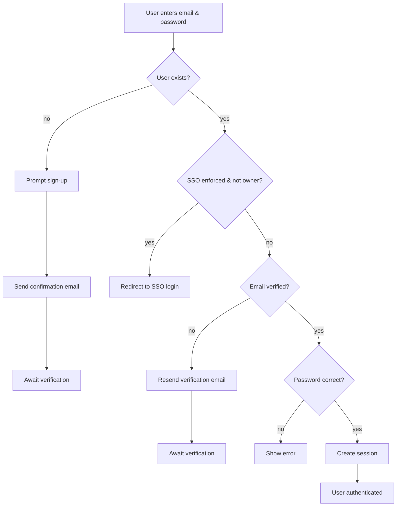
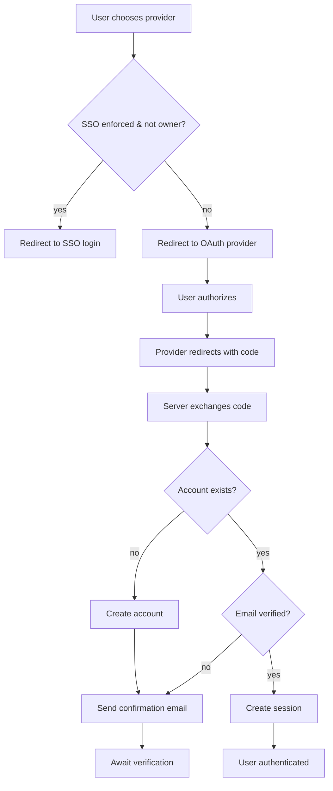
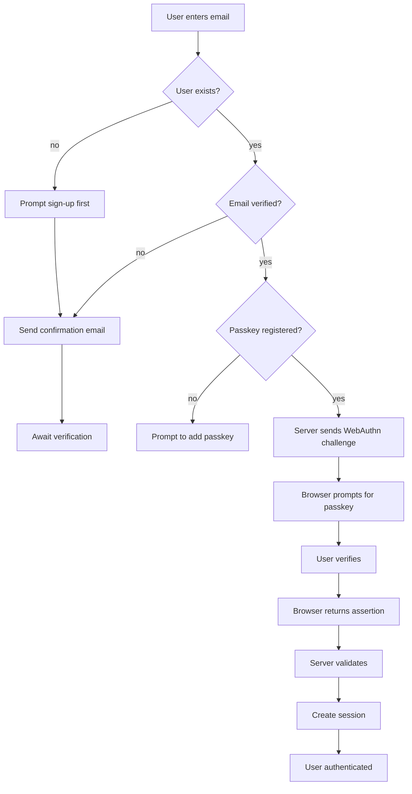
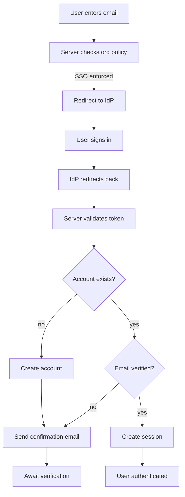
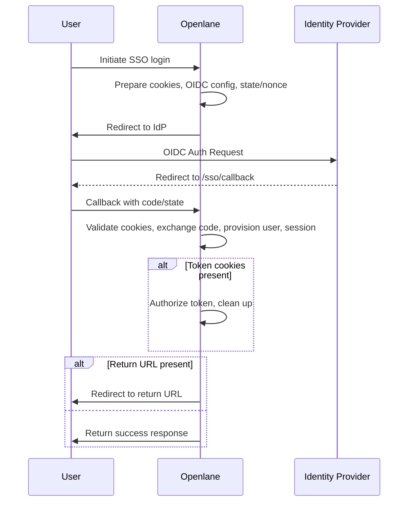

# Configuring SSO Providers

Openlane allows you to use external identity providers (IdPs) so that all authentication for your organization flows through a provider you control. The following guide explains how to configure Okta and Google Workspace as SSO providers and how to update your organization settings in Openlane.

## Prerequisites

- Admin access to your identity provider (Okta or Google Workspace)
- An organization owner role in Openlane

## 1. Configure Okta

1. Log in to Okta as an administrator and navigate to **Applications → Create App Integration**.
2. Choose **OIDC - Web Application** and select **Next**.
3. Provide a name (for example, `Openlane`) and set the following redirect URIs:
   - `https://<your-openlane-host>/oidc/callback` (replace with your domain)
4. After the application is created, copy the **Client ID** and **Client Secret**.
5. From the application's **General** tab, locate the **Okta domain** and note the **Issuer URI** (for example `https://dev-123456.okta.com/oauth2/default`). This is your OIDC discovery endpoint.

### Update Organization Settings

In Openlane, update your organization settings with the values obtained from Okta:

```graphql
mutation UpdateOrg {
  updateOrganizationSetting(
    id: "<orgSettingID>"
    input: {
      identityProvider: OKTA
      identityProviderClientID: "<client-id>"
      identityProviderClientSecret: "<client-secret>"
      oidcDiscoveryEndpoint: "<issuer-uri>"
      identityProviderLoginEnforced: true
    }
  ) {
    organizationSetting { id }
  }
}
```

Setting `identityProviderLoginEnforced` to `true` requires all organization members to authenticate through Okta.

## 2. Configure Google Workspace

1. In the [Google Cloud Console](https://console.cloud.google.com/), create a new project or select an existing one.
2. Navigate to **APIs & Services → Credentials** and choose **Create OAuth client ID**.
3. Select **Web application** as the application type and add `https://<your-openlane-host>/oidc/callback` to the list of authorized redirect URIs.
4. Download the newly created credentials or copy the generated **Client ID** and **Client Secret**.
5. Google publishes the discovery URL at `https://accounts.google.com/.well-known/openid-configuration`.

### Update Organization Settings

Use the values from Google to update your organization settings:

```graphql
mutation UpdateOrg {
  updateOrganizationSetting(
    id: "<orgSettingID>"
    input: {
      identityProvider: GOOGLE_WORKSPACE
      identityProviderClientID: "<client-id>"
      identityProviderClientSecret: "<client-secret>"
      oidcDiscoveryEndpoint: "https://accounts.google.com"
      identityProviderLoginEnforced: true
    }
  ) {
    organizationSetting { id }
  }
}
```

When the update is saved, users will be redirected to Google Workspace for sign-in.

Organization owners can still log in with their username and password even when
`identityProviderLoginEnforced` is enabled. Non-owner members will be redirected
to the configured IdP.

## 3. Verifying the Configuration

After updating the organization settings, log out of Openlane and attempt to log in again. You should be redirected to the configured identity provider. If the login process succeeds, your Openlane session will start normally.

If you need to disable SSO enforcement temporarily, update `identityProviderLoginEnforced` to `false` in your organization settings.

---

For other providers supported by Openlane (such as OneLogin or GitHub), use a similar process to create an OAuth/OIDC application and update the organization settings accordingly.


# Login Flows

This document illustrates the major authentication paths supported by Openlane.
Each flow uses [Mermaid](https://mermaid.js.org/) diagrams for clarity.

## Credential Login



The credential handler is implemented in `internal/httpserve/handlers/login.go`:

- `LoginHandler` parses a `LoginRequest` and calls `getUserByEmail` to fetch the account.
- If the account does not exist, `RegisterHandler` creates the user and `sendVerificationEmail` dispatches the confirmation email.
- `ssoOrgForUser` determines if the organization enforces SSO for the email and
  redirects non-owner users to `SSOLoginHandler` when required.
- Unverified users can request a new token via `ResendEmail`, which invokes `storeAndSendEmailVerificationToken`.
- When the password is validated with `passwd.VerifyDerivedKey`, `AuthManager.GenerateUserAuthSession` issues the access and refresh tokens and `updateUserLastSeen` records the login.

## OAuth / Social Login



The OAuth handlers are defined in `internal/httpserve/handlers/oauth_login.go` and
`oauth_register.go`:

- `GetGoogleLoginHandlers` and `GetGitHubLoginHandlers` redirect users to the provider.
- After the provider callback, `issueGoogleSession` or `issueGitHubSession` call `CheckAndCreateUser` to create or update the user record.
- `ssoOrgForUser` checks the email's organization and redirects to
  `SSOLoginHandler` when SSO is enforced for non-owner members.
- New accounts are verified by `sendVerificationEmail` inside `storeAndSendEmailVerificationToken`.
- A session is created via `AuthManager.GenerateOauthAuthSession` and the last login is stored with `updateUserLastSeen`.

## Passkey Login



Passkey operations live in `internal/httpserve/handlers/webauthn.go`:

- `BeginWebauthnLogin` issues a challenge with `WebAuthn.BeginDiscoverableLogin` and stores it in the session.
- `FinishWebauthnLogin` parses the response using `protocol.ParseCredentialRequestResponseBody` and validates it with `WebAuthn.ValidateDiscoverableLogin`.
- The user is loaded with `getUserByID`, then `AuthManager.GenerateUserAuthSession` creates the token pair.
- `updateUserLastSeen` records that the login was via a passkey.

## Organization-Enforced SSO



Single sign-on logic is implemented in `internal/httpserve/handlers/sso.go`:

- `SSOLoginHandler` checks the organization policy via `fetchSSOStatus` and redirects to the configured IdP.
- On return, `SSOCallbackHandler` exchanges the authorization code with `rp.CodeExchange` and retrieves the user data.
- The account is ensured using `CheckAndCreateUser`; new users receive a verification email via `sendVerificationEmail`.
- `AuthManager.GenerateOauthAuthSession` issues the session and the login time is recorded with `updateUserLastSeen`.

# WebFinger Endpoint

WebFinger is an HTTP discovery protocol defined by [RFC 7033](https://datatracker.ietf.org/doc/html/rfc7033). It allows a client to look up information about a resource, typically identified by a URI such as an email address.

Openlane exposes a WebFinger endpoint at `/.well-known/webfinger`. The login page queries this endpoint to determine whether an organization requires SSO authentication and which identity provider should be used.

## Querying the Endpoint

Send a `GET` request to `/.well-known/webfinger` with a `resource` parameter.

```text
/.well-known/webfinger?resource=acct:alice@example.com
/.well-known/webfinger?resource=org:01HAC1M7J3A2YHC4ZK6B2QWJNT
```

The endpoint returns an `SSOStatusReply` structure:

```json
{
  "success": true,
  "enforced": true,
  "provider": "OKTA",
  "discovery_url": "https://id.example.com/.well-known/openid-configuration",
  "organization_id": "01HAC1M7J3A2YHC4ZK6B2QWJNT"
}
```

## Why WebFinger?

Using WebFinger provides a lightweight way for the UI to discover if SSO is enforced before the user authenticates. When the email entered on the login form maps to an organization that enforces SSO, the browser can immediately redirect to the configured identity provider without any additional API calls or user interaction.


## OIDC handler flows


