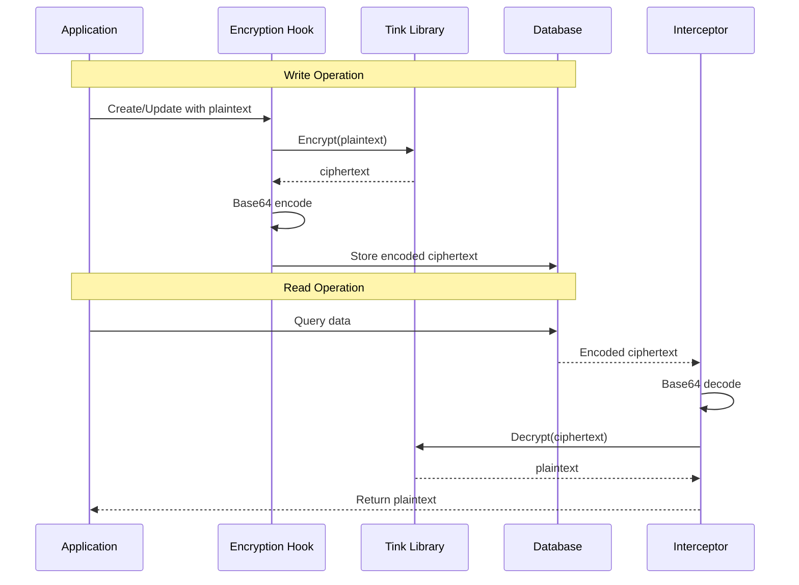

# Field-Level Encryption System

This document describes the configurable field-level encryption system for Ent schemas using Google's Tink cryptographic library, providing transparent encryption and decryption of sensitive data with envelope encryption for key rotation support.

## Table of Contents

1. [Overview](#overview)
2. [Architecture](#architecture)
3. [Quick Start](#quick-start)
4. [Usage](#usage)
5. [Security Model](#security-model)
6. [Key Management](#key-management)
7. [Configuration](#configuration)
8. [Migration](#migration)
9. [API Reference](#api-reference)
10. [Examples](#examples)
11. [Troubleshooting](#troubleshooting)
12. [Best Practices](#best-practices)

## Overview

The hush field-level encryption system provides:

* **Transparent Encryption**: Automatic encryption on write operations using Google Tink
* **Transparent Decryption**: Automatic decryption on read operations
* **Optional Encryption**: Encryption is only active when a keyset is configured
* **Graceful Degradation**: System operates normally without encryption when no keyset is provided
* **Envelope Encryption**: Support for key rotation without re-encrypting data
* **Configurable Fields**: Simple annotation-based field encryption
* **Multiple Backends**: Support for both Tink (primary) and GoCloud secrets
* **Base64 Storage**: Safe database storage of encrypted binary data
* **Migration Support**: Tools for encrypting existing unencrypted data

### Key Features

* **Zero-Code Changes**: Works transparently with existing Ent operations
* **Performance Optimized**: Minimal overhead, only encrypts when needed
* **Secure by Default**: AES-256-GCM encryption via Google Tink
* **Key Rotation**: Envelope encryption enables key rotation without data migration
* **Cloud Integration**: Optional GoCloud secrets for additional key management
* **Backward Compatible**: Graceful handling of existing unencrypted data

## Architecture

### System Architecture

```mermaid
graph TB
    subgraph "Schema Layer"
        ANNOTATION[hush.EncryptField()]
        MIXIN[Encryption Mixins]
        SCHEMA[Ent Schema]
    end

    subgraph "Processing Layer"
        HOOK[Encryption Hook]
        INTERCEPTOR[Decryption Interceptor]
    end

    subgraph "Encryption Layer"
        TINK[Google Tink]
        ENVELOPE[Envelope Encryption]
        BASE64[Base64 Encoding]
    end

    subgraph "Storage Layer"
        DATABASE[(Database)]
        ENV[Environment Variables]
    end

    ANNOTATION --> SCHEMA
    MIXIN --> SCHEMA
    SCHEMA --> HOOK
    SCHEMA --> INTERCEPTOR

    HOOK --> TINK
    INTERCEPTOR --> TINK

    TINK --> ENVELOPE
    ENVELOPE --> BASE64
    BASE64 --> DATABASE

    ENV --> TINK
```

### Data Flow



## Quick Start

### 1. Generate a Tink Keyset

```bash
# Generate a new Tink keyset for encryption
go run -tags generate ./ent/hush/cmd/hush generate

# Example output:
# OPENLANE_TINK_KEYSET=CNnD/p0JEmQKWAowdHlwZS5nb29nbGVhcGlzLmNvbS9nb29nbGUuY3J5cHRvLnRpbmsuQWVzR2NtS2V5EiIaID+JaHu+6zMW3YgphNkpL5lVJMVeZdAjJclgAHyShxUOGAEQARjZw/6dCSAB
```

### 2. Set Environment Variable

```bash
export OPENLANE_TINK_KEYSET=CNnD/p0JEmQKWAowdHlwZS5nb29nbGVhcGlzLmNvbS9nb29nbGUuY3J5cHRvLnRpbmsuQWVzR2NtS2V5EiIaID+JaHu+6zMW3YgphNkpL5lVJMVeZdAjJclgAHyShxUOGAEQARjZw/6dCSAB
```

### 3. Add Encryption to Schema

```go
package schema

import (
    "entgo.io/ent"
    "entgo.io/ent/schema/field"
    "github.com/theopenlane/ent/hush"
)

type SecretStore struct {
    ent.Schema
}

func (SecretStore) Fields() []ent.Field {
    return []ent.Field{
        field.String("name"),
        field.String("api_key").
            Sensitive().
            Annotations(
                hush.EncryptField(), // Enable encryption
            ),
    }
}

func (SecretStore) Mixin() []ent.Mixin {
    return []ent.Mixin{
        NewAutoHushEncryptionMixin(SecretStore{}), // Auto-detect encrypted fields
    }
}
```

## Usage

### Method 1: Field Annotations (Recommended)

Use the `hush.EncryptField()` annotation to mark fields for encryption:

```go
func (MySchema) Fields() []ent.Field {
    return []ent.Field{
        field.String("public_data"),
        field.String("secret_key").
            Sensitive().
            Annotations(
                hush.EncryptField(),
            ),
        field.String("api_token").
            Sensitive().
            Optional().
            Annotations(
                hush.EncryptField(),
            ),
    }
}

func (MySchema) Mixin() []ent.Mixin {
    return []ent.Mixin{
        NewAutoHushEncryptionMixin(MySchema{}),
    }
}
```

### Method 2: Pre-configured Mixins

Use built-in mixins for common encrypted field patterns:

```go
func (OAuthApp) Mixin() []ent.Mixin {
    return []ent.Mixin{
        ClientCredentialsMixin(), // Adds encrypted client_secret
        TokenMixin(),            // Adds encrypted access_token, refresh_token
        APIKeyMixin(),          // Adds encrypted api_key
    }
}
```

### Method 3: Custom Encryption Mixins

Create custom mixins for specific field configurations:

```go
func (MySchema) Mixin() []ent.Mixin {
    return []ent.Mixin{
        NewEncryptionMixin(
            EncryptedField{
                Name:      "webhook_secret",
                Optional:  true,
                Sensitive: true,
                Immutable: false,
            },
            EncryptedField{
                Name:      "private_key",
                Optional:  false,
                Sensitive: true,
                Immutable: true,
            },
        ),
    }
}
```

### Method 4: Manual Hook Configuration

For existing fields, use the field encryption mixin:

```go
func (DatabaseConfig) Mixin() []ent.Mixin {
    return []ent.Mixin{
        NewFieldEncryptionMixin("db_password", true), // Enable migration
        NewFieldEncryptionMixin("connection_string", false),
    }
}
```

## Security Model

### Encryption Details

* **Library**: Google Tink (cryptographic library)
* **Algorithm**: AES-256-GCM with AEAD (Authenticated Encryption with Associated Data)
* **Key Management**: Envelope encryption with key rotation support
* **Nonce**: Automatically managed by Tink (unique per encryption)
* **Authentication**: Built-in via AEAD
* **Storage**: Base64 encoding for safe database storage

### Why Base64 Encoding?

Encrypted data is binary and may contain:
- Null bytes (`\0`) that databases interpret as string terminators
- Invalid UTF-8 sequences that cause encoding errors
- Control characters that break text protocols

Base64 encoding ensures encrypted data is stored safely as text in any database.

### Security Properties

* **Confidentiality**: Data encrypted with AES-256-GCM
* **Integrity**: AEAD provides authentication and tamper detection
* **Key Rotation**: Envelope encryption allows key rotation without data re-encryption
* **Forward Secrecy**: Each encryption uses a unique nonce
* **Cryptographic Agility**: Tink supports algorithm migration

### Threat Model

**Protects Against**:
- Database compromise (data at rest encryption)
- Log file exposure (sensitive fields hidden)
- Backup/snapshot exposure
- Unauthorized database access
- Data tampering (AEAD authentication)

**Does NOT Protect Against**:
- Application memory dumps
- Compromise of encryption keys
- Application-level vulnerabilities
- Side-channel attacks
- Malicious application code

## Key Management

### Tink Keyset Generation

```bash
# Generate a new keyset
go run -tags generate ./ent/hush/cmd/hush generate

# Output includes the base64-encoded keyset
OPENLANE_TINK_KEYSET=<base64-encoded-keyset>
```

### Keyset Storage Options

#### 0. No Keyset (Development/Testing Only)
```bash
# Simply don't set OPENLANE_TINK_KEYSET
# All data will be stored as plaintext
# Useful for local development and testing
```

#### 1. Environment Variable (Development)
```bash
export OPENLANE_TINK_KEYSET=<keyset>
```

#### 2. Secrets Manager (Production)
```bash
# AWS Secrets Manager
aws secretsmanager create-secret \
  --name openlane-tink-keyset \
  --secret-string "<keyset>"

# Google Secret Manager
gcloud secrets create openlane-tink-keyset \
  --data-file=keyset.txt

# HashCorp Vault
vault kv put secret/openlane tink_keyset="<keyset>"
```

#### 3. Key Management Service (Enterprise)
```go
// Use Tink's KMS integration
import "github.com/tink-crypto/tink-go/v2/integration/awskms"

// Wrap keyset with KMS
kmsClient, _ := awskms.NewClient("aws-kms://arn:aws:kms:us-east-1:123456789012:key/12345678-1234-1234-1234-123456789012")
backend := aead.NewKMSEnvelopeAEAD2(kmsKeyTemplate, kmsClient)
```

### Key Rotation

Tink's envelope encryption enables key rotation without re-encrypting existing data:

1. **Generate New Keyset**
   ```bash
   go run -tags generate ./ent/hush/cmd/hush generate
   ```

2. **Add to Existing Keyset**
   ```go
   // Tink handles multiple keys automatically
   // New data uses new key, old data still decryptable
   ```

3. **Update Environment**
   ```bash
   export OPENLANE_TINK_KEYSET=<new-keyset-with-both-keys>
   ```

## Configuration

### Environment Variables

```bash
# Optional: Tink keyset for encryption
# If not set, encryption will be disabled and data will be stored as plaintext
OPENLANE_TINK_KEYSET=<base64-encoded-keyset>

# Optional: GoCloud secrets URL (overrides Tink)
SECRETS_URL=gcpkms://projects/PROJECT/locations/global/keyRings/RING/cryptoKeys/KEY
```

### Encryption Behavior

#### When `OPENLANE_TINK_KEYSET` is set:
- All fields marked with `hush.EncryptField()` are encrypted before storage
- Data is stored as base64-encoded ciphertext in the database
- Decryption happens automatically when reading data

#### When `OPENLANE_TINK_KEYSET` is NOT set:
- Encryption is completely disabled
- Fields marked with `hush.EncryptField()` are stored as plaintext
- No encryption or decryption operations occur
- System operates normally without any errors

**WARNING**: Be consistent with your encryption configuration:
- If you start with encryption enabled, keep it enabled to access encrypted data
- If you start without encryption, enabling it later will only encrypt new/updated data
- Disabling encryption after data is encrypted will make that data unreadable

### CLI Tool

Test keysets with the hush CLI:

```bash
# Generate a new keyset
go run -tags generate ./ent/hush/cmd/hush generate

# Generate quietly (script-friendly)
go run -tags generate ./ent/hush/cmd/hush generate --quiet

# Generate in export format
go run -tags generate ./ent/hush/cmd/hush generate --export

# Show keyset information
go run -tags generate ./ent/hush/cmd/hush info <keyset>
```

## Migration

### Migration Scenarios

#### Scenario 1: Enabling Encryption (No Keyset → With Keyset)

When you enable encryption for the first time:

1. Set `OPENLANE_TINK_KEYSET` environment variable
2. Existing plaintext data remains readable (migration hook detects unencrypted data)
3. New/updated data will be encrypted
4. Over time, all data becomes encrypted as records are updated

#### Scenario 2: Disabling Encryption (With Keyset → No Keyset)

**WARNING**: This makes encrypted data unreadable!

If you remove the `OPENLANE_TINK_KEYSET`:
- Existing encrypted data appears as base64 strings
- New data is stored as plaintext
- The system continues to function but encrypted data is inaccessible

#### Scenario 3: Development to Production

**Best Practice**:
- Development: Run without keyset for easier debugging
- Staging/Production: Always use a keyset for security

```bash
# Development
# No OPENLANE_TINK_KEYSET set

# Production
export OPENLANE_TINK_KEYSET=<production-keyset>
```

### Migrating Unencrypted Data

For existing databases with unencrypted sensitive data:

```go
// Enable migration in the mixin
NewFieldEncryptionMixin("password_field", true) // true = migrate unencrypted
```

### Migration Script

```go
package main

import (
    "context"
    "database/sql"
    "log"

    "github.com/theopenlane/ent/hush"
)

func main() {
    ctx := context.Background()

    db, err := sql.Open("postgres", "postgresql://...")
    if err != nil {
        log.Fatal(err)
    }

    // Migrate specific fields to encrypted format
    tables := []struct{
        table string
        field string
    }{
        {"oauth_apps", "client_secret"},
        {"api_tokens", "token"},
        {"webhooks", "signing_secret"},
    }

    for _, t := range tables {
        log.Printf("Migrating %s.%s", t.table, t.field)
        if err := hush.MigrateFieldToEncryption(ctx, db, t.table, t.field); err != nil {
            log.Printf("Failed to migrate %s.%s: %v", t.table, t.field, err)
        }
    }
}
```

### Validation

```go
// Validate all data is encrypted
err := hush.ValidateFieldEncryption(ctx, db, "oauth_apps", "client_secret")
if err != nil {
    log.Printf("Validation failed: %v", err)
}
```

## API Reference

### Annotations

#### `hush.EncryptField()`
Marks a field for encryption. Must be used with `NewAutoHushEncryptionMixin()`.

```go
field.String("secret").
    Annotations(hush.EncryptField())
```

### Mixins

#### `NewAutoHushEncryptionMixin(schema)`
Automatically detects and encrypts fields with `hush.EncryptField()` annotation.

```go
func (Schema) Mixin() []ent.Mixin {
    return []ent.Mixin{
        NewAutoHushEncryptionMixin(Schema{}),
    }
}
```

#### `NewEncryptionMixin(fields...)`
Creates custom encrypted fields.

```go
NewEncryptionMixin(
    EncryptedField{
        Name:      "field_name",
        Optional:  true,
        Sensitive: true,
        Immutable: false,
    },
)
```

#### Pre-configured Mixins
- `ClientCredentialsMixin()` - Adds `client_secret` field
- `SecretValueMixin()` - Adds `secret_value` field
- `TokenMixin()` - Adds `access_token` and `refresh_token` fields
- `APIKeyMixin()` - Adds `api_key` field

### Hooks

#### `hooks.HookFieldEncryption(field, migrate)`
Low-level hook for field encryption.

```go
hooks.HookFieldEncryption("password", true)
```

#### `hooks.HookEncryption(fields...)`
Multi-field encryption hook.

```go
hooks.HookEncryption("password", "api_key", "secret")
```

### Interceptors

#### `interceptors.InterceptorEncryption(fields...)`
Decryption interceptor for query results.

```go
interceptors.InterceptorEncryption("password", "api_key")
```

### Direct Encryption API

```go
// Encrypt data
encrypted, err := hooks.Encrypt([]byte("plaintext"))

// Decrypt data
decrypted, err := hooks.Decrypt(encrypted)

// Generate new keyset
keyset, err := hooks.GenerateTinkKeyset()
```

## Examples

### OAuth Integration

```go
package schema

import (
    "entgo.io/ent"
    "entgo.io/ent/schema/field"
    "github.com/theopenlane/ent/hush"
)

type OAuthIntegration struct {
    ent.Schema
}

func (OAuthIntegration) Fields() []ent.Field {
    return []ent.Field{
        field.String("provider"),
        field.String("client_id"),
        field.String("client_secret").
            Sensitive().
            Annotations(
                hush.EncryptField(),
            ),
        field.String("access_token").
            Optional().
            Sensitive().
            Annotations(
                hush.EncryptField(),
            ),
        field.String("refresh_token").
            Optional().
            Sensitive().
            Annotations(
                hush.EncryptField(),
            ),
    }
}

func (OAuthIntegration) Mixin() []ent.Mixin {
    return []ent.Mixin{
        NewAutoHushEncryptionMixin(OAuthIntegration{}),
    }
}
```

### Usage Example

```go
// Create with automatic encryption
integration, err := client.OAuthIntegration.Create().
    SetProvider("github").
    SetClientID("github-client-id").
    SetClientSecret("super-secret-key").     // Automatically encrypted
    SetAccessToken("ghp_xxxxxxxxxxxx").      // Automatically encrypted
    SetRefreshToken("ghr_xxxxxxxxxxxx").     // Automatically encrypted
    Save(ctx)

// Read with automatic decryption
integration, err = client.OAuthIntegration.Get(ctx, id)
fmt.Println(integration.ClientSecret)  // Decrypted automatically

// Query - all results decrypted
integrations, err := client.OAuthIntegration.Query().
    Where(oauthintegration.Provider("github")).
    All(ctx)
```

### Database Password Encryption

```go
type DatabaseConfig struct {
    ent.Schema
}

func (DatabaseConfig) Fields() []ent.Field {
    return []ent.Field{
        field.String("name"),
        field.String("host"),
        field.String("username"),
        field.String("password").
            Sensitive().
            Annotations(
                hush.EncryptField(),
            ),
    }
}

func (DatabaseConfig) Mixin() []ent.Mixin {
    return []ent.Mixin{
        NewAutoHushEncryptionMixin(DatabaseConfig{}),
    }
}
```

## Troubleshooting

### Common Issues

#### "Field not encrypted"
- Verify mixin is applied to schema
- Check field has `hush.EncryptField()` annotation
- Ensure `NewAutoHushEncryptionMixin()` is in mixins
- Confirm `OPENLANE_TINK_KEYSET` is set

#### "Decryption failed"
- Check keyset hasn't changed
- Verify data was encrypted with same keyset
- Ensure base64 encoding is intact
- Check for data corruption

#### "Cannot initialize Tink"
- Verify `OPENLANE_TINK_KEYSET` is valid base64
- Check keyset is properly formatted
- Try generating a new keyset

#### "Data appears as base64 gibberish"
- This occurs when encryption was previously enabled but is now disabled
- The data is encrypted and needs the original keyset to decrypt
- Re-enable encryption with the original keyset to access the data

### Debug Commands

```bash
# Test encryption works with new keyset
KEYSET=$(go run -tags generate ./ent/hush/cmd/hush generate --quiet)
echo "Generated keyset: $KEYSET"

# Verify keyset is valid
echo $OPENLANE_TINK_KEYSET | base64 -d | xxd

# Check field in database
psql -c "SELECT field FROM table LIMIT 1"
# Should show base64, not plaintext
```

### Testing

```go
func TestEncryption(t *testing.T) {
    // Set test keyset
    os.Setenv("OPENLANE_TINK_KEYSET", testKeyset)

    client := enttest.Open(t, "sqlite3", "file:ent?mode=memory")
    defer client.Close()

    // Create entity
    entity, err := client.MyEntity.Create().
        SetSecret("plaintext-secret").
        Save(ctx)
    require.NoError(t, err)

    // Verify decrypted on read
    assert.Equal(t, "plaintext-secret", entity.Secret)

    // Verify encrypted in database
    var dbValue string
    client.DB().QueryRow(
        "SELECT secret FROM my_entities WHERE id = ?",
        entity.ID,
    ).Scan(&dbValue)

    // Should be base64 encrypted
    assert.NotEqual(t, "plaintext-secret", dbValue)
    _, err = base64.StdEncoding.DecodeString(dbValue)
    assert.NoError(t, err)
}
```

## Best Practices

### 1. Field Selection
- Only encrypt truly sensitive data (passwords, tokens, keys)
- Don't encrypt fields used in WHERE clauses
- Consider performance impact for large fields

### 2. Key Management
- Use proper key storage in production (not environment variables)
- Implement key rotation policies
- Back up keysets securely
- Use separate keys for different environments

### 3. Schema Design
```go
// Good: Specific sensitive fields
field.String("api_token").
    Sensitive().
    Annotations(hush.EncryptField())

// Bad: Encrypting everything
field.String("user_id").
    Annotations(hush.EncryptField()) // Don't encrypt IDs!
```

### 4. Migration Strategy
- Test migrations on a copy first
- Implement gradual rollout
- Have rollback plan ready
- Monitor for decryption errors

### 5. Monitoring
- Alert on decryption failures
- Track encryption/decryption performance
- Monitor for plaintext leaks in logs
- Audit field access patterns

### 6. Compliance
- Document which fields are encrypted
- Maintain encryption inventory
- Track key rotation history
- Implement access controls

---

For additional support or questions about the field-level encryption system, please refer to the development team or create an issue in the repository.