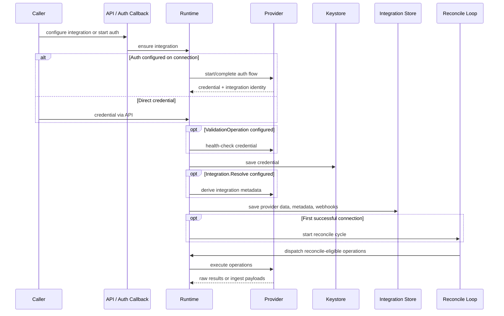

# Integrations Architecture

The integration system compiles provider builders into a single provider package per definition. That package covers setup, auth, credential collection, client construction, operations, mappings, and webhooks.

## Core Model

```
Integration (per-tenant record)
│
│  user input ·········· non-secret config
│  provider data ······· active credentialRef
│  metadata ············ external account / workspace / tenant identity
│
└─► Definition (reusable provider package, shared across integrations)
    │
    │  OperatorConfig ·· process-wide secrets and config the builder needs
    │  UserInput ······· per-integration config collected from the user
    │
    ├── Credential Registrations ─────────────────────────────────────────────┐
    │   Declare what secrets the provider needs (API keys, tokens, etc.)      │
    │   and how to collect them from the user                                 │
    │                                                                         │
    ├── Client Registrations ─────────────────────────────────────────────────┤
    │   Factories that build SDK/API clients from credentials                │
    │   Cached by Keystore per integration so we don't rebuild on every call  │
    │                                                                         │
    ├── Mappings ─────────────────────────────────────────────────────────────┤
    │   CEL expressions that transform provider data into our                 │
    │   internal data model                                                   │
    │                                                        ╭─ references ──╯
    │                                                        ▼
    ├── Connections ───────────────────────────────────────────────────────────
    │   Wire together credential slots + clients from above, and configure:
    │     Auth ············· how to acquire credentials (browser, app-install, etc.)
    │     Disconnect ······· how to tear down (revoke tokens, uninstall app, etc.)
    │     Validation op ···· how to verify credentials work before saving
    │     Resolve ·········· how to identify the external account/workspace (what did we connect to)
    │
    ├── Operations ────────────────────────────────────────────────────────────
    │   Actions the provider can perform (sync data, send messages, etc.)
    │     Client ref ······· which client to use if a client is needed
    │     Ingest ··········· which internal data models this op can produce
    │     Policy ··········· inline vs queued, reconcile-eligible or not
    │                        (Reconcile ops auto-dispatch on first connection)
    │
    └── Webhooks ──────────────────────────────────────────────────────────────
        Receive inbound events from the provider
          Events ··········· each event type has its own handler and ingest
                             reconciled on first successful connection
```

### Who runs what

| Component | What it does |
|-----------|-------------|
| Builders | Compile definitions at startup |
| Registry | Validate and index definitions |
| Runtime | Integration lifecycle, credential updates, operation dispatch, ingest, webhook routing |
| Keymaker | Temporary auth sessions and callback validation |
| Keystore | Long-lived credentials and pooled client caching |

### Where data lives

We store these separately because they change at different rates and for different reasons - credential rotation shouldn't require touching user config, and temporary auth callbacks shouldn't share a lifecycle with long-lived secrets.

| Data | Scope | Changes when | Examples |
|------|-------|-------------|----------|
| Operator config | Process-wide | Deploy | Client IDs, secrets, redirect URLs |
| User input | Per integration | Reconfigure | Non-secret config fields |
| Credentials | Per integration + slot | Rotation | OAuth tokens, API keys |
| Provider data | Per integration | Connection change | Active `credentialRef` |
| Integration metadata | Per integration | First connection | Account name, workspace, tenant ID |
| Webhook rows | Per integration + webhook | Creation | Endpoint identity, verification secret |
| Keymaker auth data | Per auth flow | Ephemeral | Callback nonces (not the stored credential) |

### Setup flow

The runtime walks through the same reconciliation path regardless of how the credential arrives (direct input, OAuth exchange, or app-install callback). The connection's fields determine which steps actually run, so adding auth or validation to a connection automatically changes the setup behavior without touching the runtime:

1. Resolve or create the integration
1. If user input is provided, validate it against the definition's schema and persist
1. Resolve the connection from `credentialRef`
1. If `Auth` is configured, run the auth flow (start/redirect/callback) to produce the credential
1. Validate the credential against the slot's schema
1. If a `ValidationOperation` is configured, execute it as a health check
1. Save the credential to keystore
1. Persist the active connection in provider data
1. If `Integration.Resolve` is configured, derive and save integration metadata
1. On first successful connection: reconcile webhooks and dispatch reconcile-eligible operations



## Execution Model

All entrypoints - manual API calls, the reconcile scheduler, the workflow engine, and inbound webhooks - converge on the same execution and ingest path. This means every provider operation gets the same credential resolution, client caching, run tracking, and ingest behavior regardless of what triggered it. The runtime loads the integration and definition, builds or reuses a client, runs the operation, and either returns a raw result or feeds the output through mappings into our internal data model.

- Manual callers can run inline operations synchronously or queue persistent runs
- Reconciliation dispatches the definition's non-inline operations after the first successful connection
- Workflow-triggered runs add workflow metadata and complete through the same run path
- Webhooks either dispatch operations or emit ingest directly; delivery IDs provide idempotency when available
- Push-style integrations use the same flow but skip per-integration secret credentials and recurring polling (this is basically only SCIM but a good example of the built in flexibility to accommodate the wide variety of capabilities under the same roof)

## Ingest Handoff

Provider operations and webhook handlers usually stop at provider-shaped payloads. We split it this way so provider code only worries about collecting data from the external API, and doesn't need to know anything about our internal models or persistence. The shared ingest path takes over from there:

1. Verify the emitted schema is declared by the operation or webhook
1. Resolve the mapping for that schema and variant
1. Apply integration-level and definition-shipped CEL filters
1. Apply the CEL map expression
1. Resolve the mapping's cross-object link rules and write the matched target ids into the payload
1. Decode and persist the result into our internal data model

## Stable Names and Schema-Derived IDs

Many identifiers in a definition (credential slot names, operation names, webhook event names) end up stored in the database, used in routing, and returned in API responses. Renaming them is a breaking change, so how we produce them matters.

We considered a few approaches:

- **Database-generated IDs** - these are opaque, so you can't look at a credential slot or operation and know what it is without a lookup. They also create a chicken-and-egg problem: the definition needs to reference its own parts before they're persisted
- **Developer-assigned slugs** - these work, but they're hand-written strings that duplicate information already captured by the Go type. Two developers can independently pick conflicting names, and there's no compile-time signal when that happens
- **Go type-derived names** (what we do) - the name of the Go struct that defines a credential, operation config, or webhook event *is* the identifier. The compiler already enforces uniqueness within a package, so collisions between definitions are structurally impossible without deliberate effort. Renaming a type is a visible, reviewable change

The tradeoff is that Go type names become part of the public interface. Renaming `GitHubAppToken` to `GitHubInstallationToken` is a migration, not a refactor. We accept this because the alternative - invisible string drift between code and stored identifiers - is worse.

A few identifiers (definition IDs, webhook names) are still set explicitly because they don't map cleanly to a single Go type. Client IDs are ephemeral and in-process only, so they don't need stability at all.

Topics for operations and webhook events are built deterministically from definition ID + operation/event name. Once names are unique within a definition, topic uniqueness follows automatically. Refs are bound once at package scope and reused everywhere, so there's one declaration site per identifier.

## Evolving a Definition

### Adding a new credential or auth mode

1. Choose the credential-slot name first - this becomes part of the public interface
1. Define the credential schema around the final persisted secret, not temporary auth data
1. Register the slot and add or update a connection that selects it
1. On that connection, declare every participating slot, enabled client, validation logic, auth logic, integration metadata derivation, and disconnect cleanup
1. If existing clients are shared across modes, make credential resolution deterministic
1. Test new install, update-in-place, mode switching, and disconnect

Keep non-secret selectors in user input or integration metadata. Don't overload credential payloads with display or routing data.

### Adding a new operation

1. Choose the operation name before writing logic - if it's schema-derived, the root config type name is part of the public interface
1. Define a typed config schema even if the input is small
1. Decide whether the operation is inline or queued, client-backed or clientless, and raw-result or ingest-producing
1. Register it with one execution path only. If it emits ingest, declare every internal model it can produce
1. Add or update mappings for each emitted schema and variant
1. Test provider logic first, then runtime validation and queueing behavior, then ingest behavior when applicable

### CEL guidance

Available variables are `envelope`, `variant`, `resource`, `action`, and `payload`.

Use CEL for filtering and projection, not heavy normalization. If the expression starts encoding provider-specific control flow, that logic belongs in provider code instead.

- Empty filter means allow the payload through
- Empty map means use the raw payload as-is
- Prefer small, explicit object construction over large ad hoc expressions
- Preserve the fields the target model needs — its lookup key for dedup, required fields, and any fields link rules match on
- Use integration-level filters for tenant scoping and definition-shipped filters for payload semantics

### Builder gotchas

- The selecting `credentialRef` must belong to the connection that uses it
- Auth and disconnect must refer only to slots in that same connection
- A credential slot with no user-facing schema is meaningful, not incomplete. Auth-managed slots work this way because the browser or app-install flow produces the credential, so there's nothing to render in a manual form
- Adding a credential schema to an auth-managed slot changes setup UX: it now exposes fields for manual entry
- A client can support multiple slots, but the build path still has to resolve one unambiguous credential shape
- An operation must have exactly one execution path
- Ingest-producing operations must declare what internal models they emit
- Integration metadata should represent the external system being connected, not transient setup details
- The first successful connection can activate recurring behavior such as reconciliation, not just mark the row connected

## `entityops` and Ent Annotations

The ingest layer targets internal models through `entityops` (`internal/ent/entityops`), a single catalog generated during `entc` post-generation from annotations on the ent schemas. The same catalog serves the workflow engine, so integrations and workflows share one authoritative description of every eligible model: its mapped fields and their roles, its edges and how they're set, typed ingest events and topics, and a flat projection per model for CEL evaluation.

```text
Ent annotations (integration mapping + workflow eligibility)
└── entc post-generation hook
    └── internal/ent/entityops — one generated catalog, consumed by
        ├── internal/integrations (ingest, linking, persistence)
        └── internal/workflows   (conditions, triggers, object actions)
```

The annotations do two jobs:

- Schema-level opt-in marks an internal model as part of the integration mapping surface
- Field-level flags mark which fields may be mapped from provider data, which column deduplicates re-ingested records (the lookup key), and which values are stamped from the integration itself rather than the payload

What the catalog buys at runtime:

- **Typed identifiers everywhere.** Definitions reference generated schema names and input-key constants instead of hand-typed strings, so a wrong field name is a compile error or a registration failure — never silently dropped data
- **Dedup by lookup key.** Records are upserted against their schema's declared lookup column: re-ingesting the same external record updates it in place, and a lookup that matches more than one row fails rather than guessing
- **No generated tier inside `operations`.** Everything under `internal/integrations` is handwritten and safe to edit; everything under `internal/ent/entityops` is generated and must be regenerated. The old "generated starting point" persistence stubs are gone — most models persist through the catalog directly, and the handful of models whose semantics genuinely differ (multi-key lookup priority, integration-scoped rather than organization-scoped dedup, membership episode tracking) keep ordinary handwritten persistence

## Cross-Object Linking

Ingested records can be created already linked to existing records — an ingested finding arrives connected to the controls whose reference codes appear in its categories, in the same mutation that creates it. Because the matched ids ride the create input, linking is atomic (no orphaned record when a link fails), works for edges that can only be set at creation, and behaves identically on the synchronous and queued ingest paths. On re-ingest, links are re-applied additively: newly matched targets are added, and existing links are never removed, since an edge carries no record of whether a person or an integration created it.

Link rules are declared on the definition's mappings and are not installation-configurable. Every rule is validated against the catalog when the definition registers, so a bad field reference, a mismatched match shape, or a target type the source reaches through more than one edge (which must name the edge explicitly) fails at startup rather than misbehaving during a sync. The definition payload surfaces a per-edge inventory of linkable targets and usable fields for display purposes.

The workflow engine's object-creation action shares this machinery, so a workflow definition can set edges with the same semantics as an ingest mapping.

### How a link is configured

A mapping declares `Links []types.LinkRule`. Each rule names the target object type and how to match candidates — either a **field match** (indexed query push-down) or a **CEL expression**:

```go
// internal/integrations/definitions/cloudflare/mappings.go
// Field names are typed references, never hand-typed strings: the target side uses the ent
// field constants, the source side uses the generated entityops input-key constants.
Spec: types.MappingOverride{
    MapExpr: mapExprFinding,
    Links: []types.LinkRule{
        // field match: Control.ref_code IN (finding.category, finding.categories[*])
        {
            TargetSchema: entityops.SchemaControl.Name,
            TargetField:  control.FieldRefCode,
            SourceField:  entityops.InputKeyFindingCategory,
            SourceList:   entityops.InputKeyFindingCategories,
        },
    },
},
```

```go
// CEL expression: non-equality / multi-field conditions. "target" is the candidate, "source" is the ingested record.
{TargetSchema: entityops.SchemaAsset.Name, Edge: "child_assets", Expression: `target.name == source.resource_name || source.resource_name.startsWith(target.name + "/")`},
```

A rule uses a field match **or** an expression. Field match is the fast path — it compiles to an indexed `IN` query scoped to the organization — so reach for an expression only when the match isn't a single-field equality.
