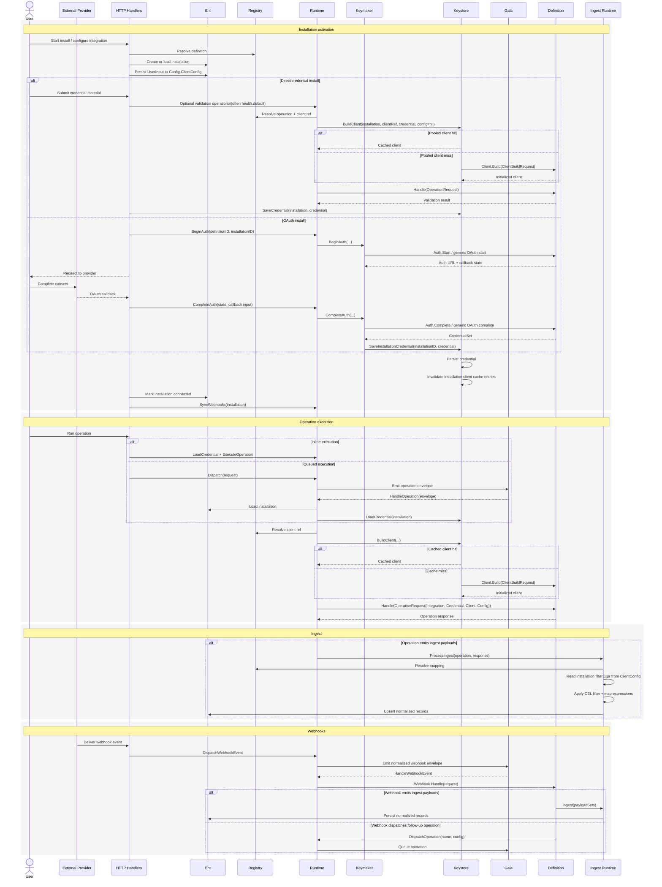

# Integrations

`internal/integrations` is the package family that defines, registers, executes, and ingests provider integrations.

It covers:

- provider definition contracts
- installation-scoped credential storage
- installation-scoped client construction and pooling
- operation dispatch and execution
- webhook handling
- payload mapping and ingest

## Package Map

- `definition/`
  Builds and registers definition manifests
- `definitions/`
  Built-in provider implementations
- `registry/`
  In-memory definition, client, operation, and webhook lookup
- `runtime/`
  Main facade used by handlers and workers
- `operations/`
  Dispatch, run tracking, execution, and ingest
- `providerkit/`
  Shared helpers for schemas, OAuth, CEL, envelopes, results, and HTTP clients
- `types/`
  Shared contracts used across the runtime

Related packages:

- `internal/keymaker`
  Auth start/callback orchestration and credential persistence after auth completion
- `internal/keystore`
  Credential persistence and installation-scoped client pooling

## Core Concepts

### Definition

A definition is the unit of integration behavior. It can declare:

- catalog metadata
- installation-scoped `UserInput`
- credentials schema
- auth behavior
- one or more clients
- one or more operations
- mappings for ingest
- webhook contracts

### Installation

An installation is a persisted `Integration` record plus its associated state:

- installation-scoped user input is stored on `integration.Config.ClientConfig`
- credentials are stored separately in keystore-backed hush secrets
- operations execute against one installation

### Client

A client is a provider SDK object or authenticated HTTP wrapper built for one installation.

In runtime terms, clients are installation-scoped today because the keystore pools them by:

- installation ID
- client ref
- credential content
- operation config payload

Definitions usually receive that built client as `request.Client` and then type-assert it with a `FromAny` helper.

### Operation

An operation is a named executable unit such as:

- `health.default`
- `directory.sync`
- `vulnerabilities.collect`

Operations can be inline or queued, and can optionally emit ingest payload sets.

### Ingest

Ingest turns provider payloads into normalized records by:

- finding the correct mapping for schema and variant
- applying installation-level and mapping-level CEL filters
- applying a CEL map expression
- upserting the normalized record

## End-To-End Flow



## Definition Authoring

Each built-in provider lives under `internal/integrations/definitions/<provider>/`.

The default goal is:

- keep provider-specific behavior self-contained in one package
- keep shared runtime concerns in `runtime/`, `operations/`, and `providerkit/`
- make the package shape predictable across providers

### Recommended Default Files

Create these by default for a new provider package:

```text
definitions/<provider>/
  builder.go
  client.go
  operations.go
  errors.go
```

Add these when needed:

```text
  config.go        # operator config, shared UserInput, shared config types
  auth.go          # OAuth or custom auth helpers
  mappings.go      # default ingest mappings
  webhook.go       # inbound webhook handlers and contracts
  schema.go        # JSONSchemaExtend hooks
  *_test.go        # schema, client, auth, operation, or ingest tests
```

### Recommended Default Types

Start with these types by default:

- `UserInput`
  Installation-scoped user configuration
- `CredentialSchema`
  Persisted credential/provider data shape for direct-credential providers
- `Client`
  The provider client builder and `FromAny` caster
- one struct per operation
  Example: `HealthCheck`, `FindingsCollect`, `DirectorySync`
- one config struct per configurable operation
  Example: `FindingsConfig`, `DirectorySyncConfig`

Add these only when the provider needs them:

- `Config`
  Operator-owned config supplied at runtime startup
- auth state / callback payload structs
- webhook payload wrapper structs

### Definition Conventions

- `builder.go` should be the registration entrypoint
- `UserInput` should live close to the builder unless it is reused heavily
- operation handlers should be thin adapters around typed `Run(...)` methods
- `Client.Build(...)` should build the provider client from `ClientBuildRequest`
- `Client.FromAny(...)` should only type-assert the already-built pooled client
- mapping and ingest logic should prefer shared `providerkit` helpers

One subtle but important rule:

- if a client builder starts depending on more installation state than `credential` and `config`, make sure the keystore cache key and invalidation model still match that behavior

## Template Directory

Literal provider scaffolds live in:

- `internal/integrations/definitions/_template/`

That directory is meant to be copied into a new provider package and then find-and-replaced.

The base template files are:

- `builder.go`
- `client.go`
- `operations.go`
- `errors.go`
- `config.go`

Optional add-ons are also included there:

- `mappings.go`
- `schema.go`

Template placeholders to replace first:

- `yourprovider`
- `Your Provider`
- `YourClient`
- `def_REPLACE_ME`
- `REPLACE_ME`

## Practical Defaults

If you are starting a new provider and want the smallest sensible shape:

1. Copy `internal/integrations/definitions/_template/` into a new provider package
2. Keep `builder.go`, `client.go`, `operations.go`, and `errors.go`
3. Add `UserInput` with at least `label` and `filterExpr`
4. Add a `health.default` operation first
5. Register exactly one client unless there is a real need for more
6. Add `mappings.go` only if the provider emits ingest payloads
7. Add `auth.go` only if the provider needs OAuth or another install flow
8. Add `webhook.go` only if the provider receives inbound events

That shape keeps most providers consistent while leaving room for more complex auth, ingest, or webhook behavior when it is actually needed
