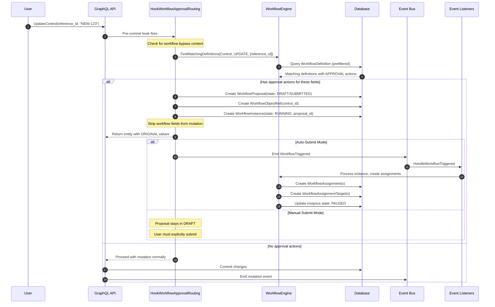
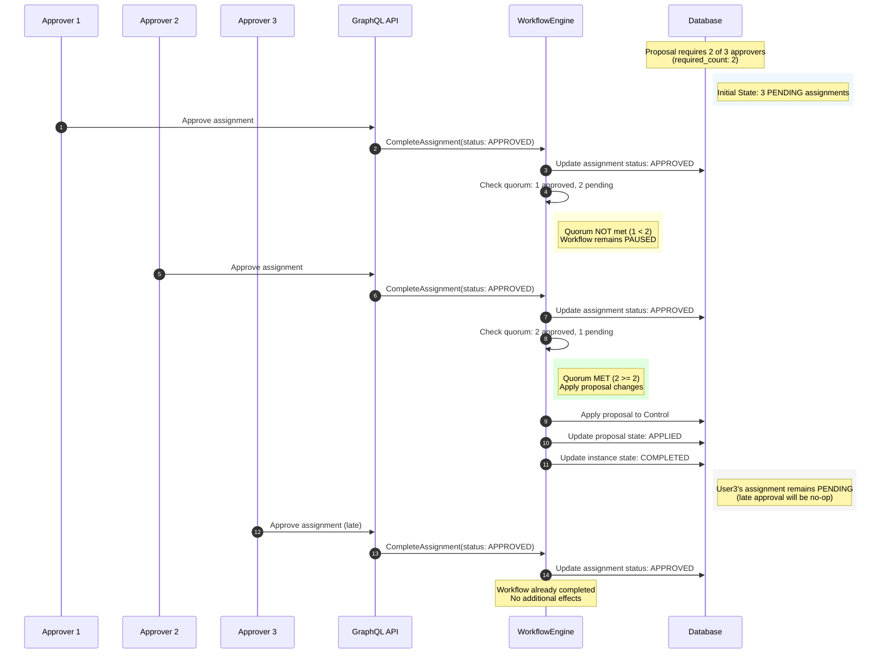
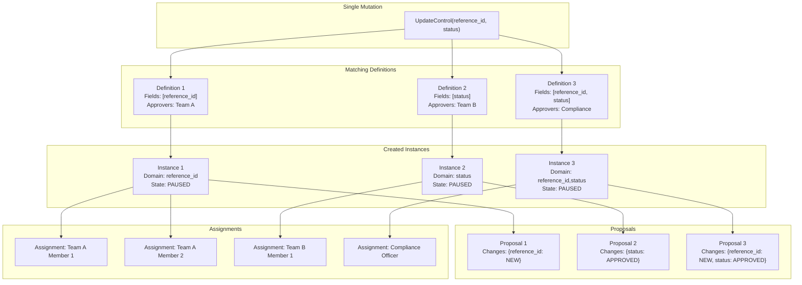
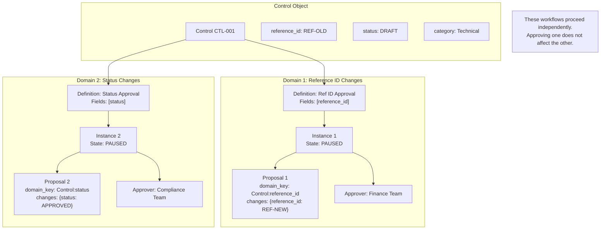
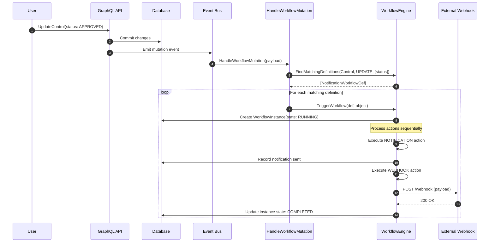
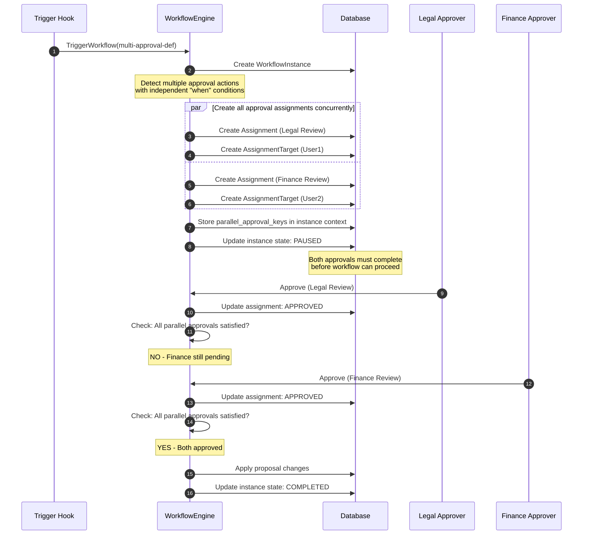
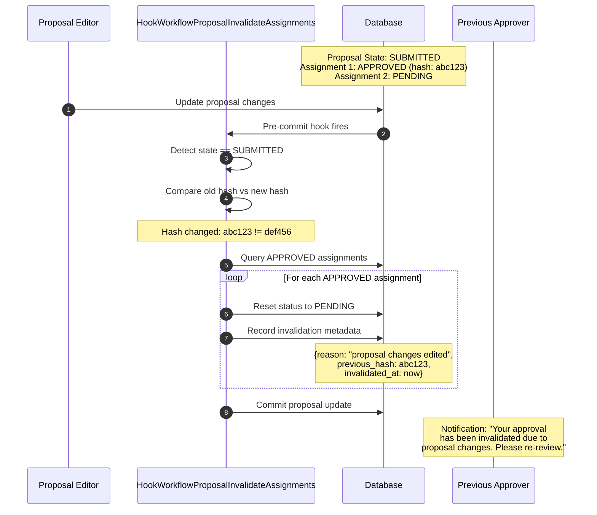
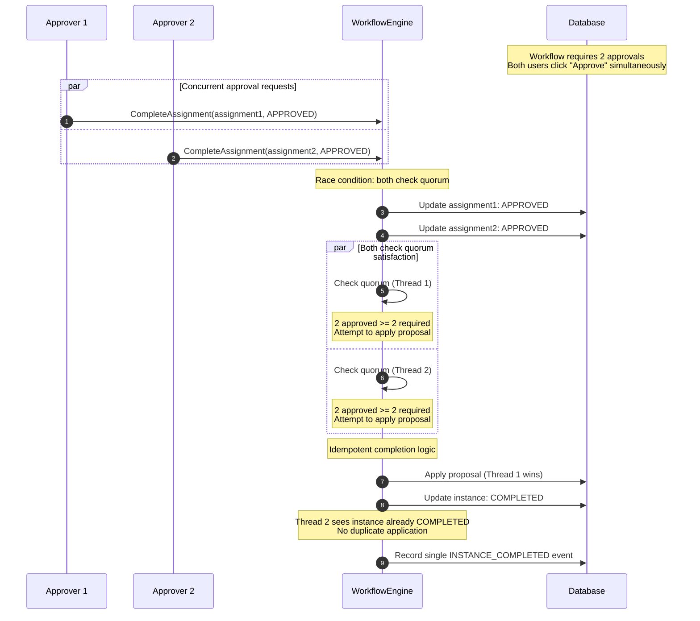
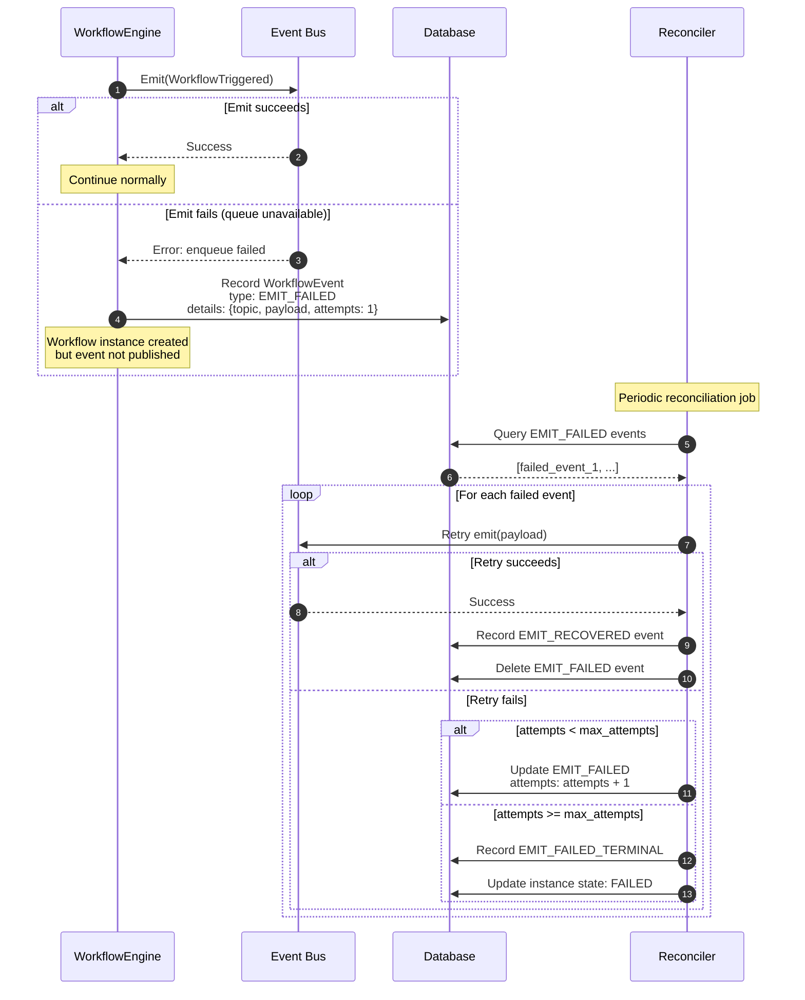
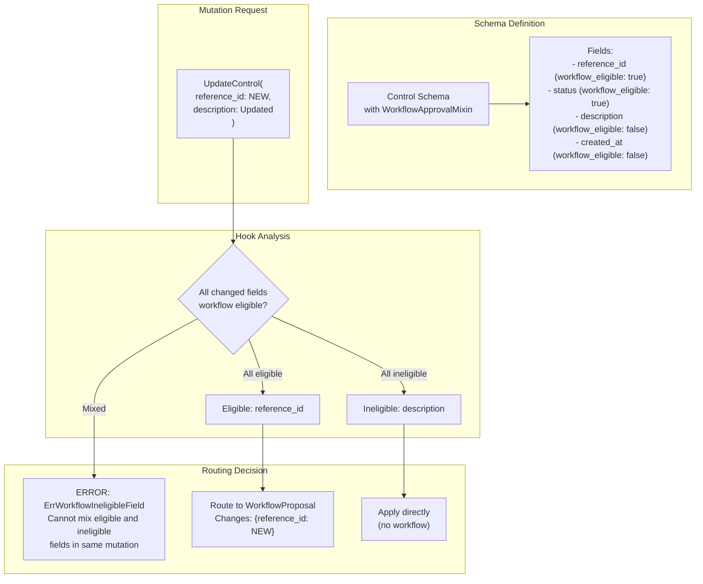

# Workflow Engine Architecture

This document explains how the workflow engine operates within the Openlane platform, including the flow of data through hooks, events, and the engine itself.

## Overview

The workflows capability is built on simple composable primitives that combine into complex behaviors:

| Primitive         | Purpose            | Example                        |
|-------------------|--------------------|--------------------------------|
| Trigger           | When to evaluate   | field modified, edge added     |
| Condition         | Whether to proceed | object.status == "DRAFT"       |
| When (per action) | Action-level gate  | assignments.approved >= 3      |
| Action            | What to do         | APPROVAL, NOTIFY, FIELD_UPDATE |
| Operators         | Composition        | field_modified AND is_tuesday  |

The engine evaluates triggers → checks conditions → executes actions (respecting their `When` expressions, e.g. blocking on approvals until criteria met).

Any meaningful sequential vs concurrent distinction around execution emerges from how you structure the definition, not from engine constraints:
- One approval action with multiple targets + quorum = concurrent
- Multiple approval actions = sequential with dependencies
- When expressions = conditional execution based on state

There is an action index as a part of the executor, but it is just tracking progression through the action list, with approvals creating natural "gates" that block until their criteria are satisfied. The engine doesn't impose ordering beyond that - the definition author controls the flow through how they structure actions and their conditions.

## High level Architecture

You can simplify all of the moving parts related to workflows into 2 buckets:
- Bucket 1: pre-commit interception, where we fork into a "proposed" change
- Bucket 2: post-commit events, where we're responding after a transaction

### Pre-Commit Interception

For workflows where we intercept the change before its applied :

```
User Request ──► Hook intercepts ──► Creates WorkflowProposal ──► Returns unchanged entity
                     │
                     ▼
            Proposal submitted ──► WorkflowInstance created ──► Assignments created
                                                                      │
                                                                      ▼
                                                              Users approve/reject
                                                                      │
                                                                      ▼
                                                              Quorum satisfied?
                                                                      │
                                          ┌───────────────────────────┴───────────┐
                                          │                                       │
                                          ▼                                       ▼
                                    YES: Apply                              NO: Fail
                                    proposal changes                        workflow
                                    to entity
```

### Post-Commit Events

For workflows that react to changes:

```
User Request ──► Mutation commits ──► soiree event emitted ──► handleWorkflowMutation
                                                                      │
                                                                      ▼
                                                              Find matching definitions
                                                                      │
                                                                      ▼
                                                              Trigger workflows
                                                              (NOTIFY, WEBHOOK, etc.)
```

## Key Components

### Hooks

| Hook | Purpose | Trigger |
|------|---------|---------|
| `HookWorkflowApprovalRouting` | Intercepts mutations, routes to proposal if approval required | UPDATE on workflowable schemas |
| `HookWorkflowProposalTriggerOnSubmit` | Starts workflow when proposal submitted | CREATE/UPDATE on WorkflowProposal |
| `HookWorkflowProposalInvalidateAssignments` | Invalidates approvals when proposal changes edited | UPDATE on WorkflowProposal |
| `HookWorkflowDefinitionPrefilter` | Derives trigger prefilter fields from definition JSON | CREATE/UPDATE on WorkflowDefinition |

### Approval Submission Modes

Workflow definitions with approval actions have an `approvalSubmissionMode` that controls when the approval process begins:

| Mode | Proposal Initial State | Behavior |
|------|----------------------|----------|
| `AUTO_SUBMIT` | `SUBMITTED` | Approval assignments are created immediately when the mutation is intercepted. Approvers are notified right away. This is the standard flow. |
| `MANUAL_SUBMIT` | `DRAFT` | The proposal is created in DRAFT state. Assignments are NOT created until the proposal is explicitly submitted. |

**Current Implementation Note:**
`AUTO_SUBMIT` is the primary supported mode. The `MANUAL_SUBMIT` mode creates proposals in DRAFT state, but the GraphQL mutation to submit draft proposals is not yet exposed (`WorkflowProposal` is an internal entity with `entgql.Skip(entgql.SkipAll)`). When MANUAL_SUBMIT support is completed, it will enable staging changes before requesting approval.

### Definition Prefiltering

WorkflowDefinition persists derived trigger fields (`trigger_operations`, `trigger_fields`) for coarse SQL prefiltering. These are computed from `definition_json` by `HookWorkflowDefinitionPrefilter` and used by `FindMatchingDefinitions`
to reduce the candidate set before reading the full JSON and evaluating triggers.

Key properties:
- Intentionally lossy: `trigger_fields` is a union across triggers and does not preserve per-trigger pairing.
- Selectors and trigger expressions are not represented.
- If any trigger omits fields/edges, `trigger_fields` is cleared (nil) to avoid false negatives.
- The JSON definition remains the source of truth; prefiltering only excludes impossible matches.

Safe exclusion criteria:
- `eventType` not in `trigger_operations`.
- `trigger_fields` is non-empty and has no overlap with changed fields/edges.

### Event Listeners

| Listener | Event | Purpose |
|----------|-------|---------|
| `HandleWorkflowTriggered` | WorkflowTriggered | Process newly triggered instance, start first action |
| `HandleActionStarted` | ActionStarted | Execute the action (approval, notify, etc.) |
| `HandleActionCompleted` | ActionCompleted | Advance to next action or complete workflow |
| `HandleAssignmentCompleted` | AssignmentCompleted | Check quorum, resume workflow if satisfied |
| `HandleInstanceCompleted` | InstanceCompleted | Mark instance as completed/failed |

### Workflow Engine

| Component | Purpose |
|-----------|---------|
| `engine.go` | Core engine: FindMatchingDefinitions, TriggerWorkflow, ProcessAction |
| `executor.go` | Action executors: APPROVAL, NOTIFY, FIELD_UPDATE, WEBHOOK, etc |
| `evaluator.go` | CEL expression evaluation for conditions and When clauses |
| `resolver.go` | Target resolution (users, groups, custom resolvers) |
| `listeners.go` | Event handlers and workflow state management |

## Approval Invalidation

When a WorkflowProposal's changes are modified after approvals have been given:

1. `HookWorkflowProposalInvalidateAssignments` detects the change
1. All APPROVED assignments are reset to PENDING
1. Invalidation metadata is recorded (who, when, hash diff)
1. Affected users are notified
1. Re-approval is required

This implements GitHub-style "dismiss stale reviews" behavior.

## Adding Workflow Support to a Schema

1. Add the `WorkflowApprovalMixin` to your schema:

```go
func (Policy) Mixin() []ent.Mixin {
    return []ent.Mixin{
        // ... other mixins
        WorkflowApprovalMixin{},
    }
}
```

1. Register eligible fields in the workflow metadata (use the entx annotation)
1. Add edges from WorkflowObjectRef schema if they don't already exist
1. Run code generation / `task regenerate`, merge the output / changes
1. Create workflow definitions targeting your schema type and test it out

## Workflow Definition Structure

There are a few examples included in this package, and you can find the types in our models if you want to look at all the various fields, but here's a representative example of policy approvals:

```json
{
  "name": "Policy Approval Workflow",
  "schemaType": "Policy",
  "workflowKind": "APPROVAL",
  "approvalSubmissionMode": "AUTO_SUBMIT",
  "triggers": [
    {
      "operation": "UPDATE",
      "fields": ["description", "details"],
      "expression": "object.status == 'PUBLISHED'"
    }
  ],
  "conditions": [
    {
      "expression": "object.category != 'INTERNAL'"
    }
  ],
  "actions": [
    {
      "key": "manager_approval",
      "type": "APPROVAL",
      "params": {
        "targets": [{"type": "RESOLVER", "resolver_key": "object_owner"}],
        "required_count": 1
      }
    },
    {
      "key": "notify_team",
      "type": "NOTIFICATION",
      "when": "assignments.approved >= 1",
      "params": {
        "targets": [{"type": "GROUP", "id": "policy-team-group-id"}],
        "title": "Policy {{object.name}} approved",
        "body": "The policy has been approved and changes applied."
      }
    }
  ]
}
```

## Events and Event Topics

These are the “statuses” stored in workflow_events.event_type and payload.event_type. We only persist
business-facing snapshots plus emit failure tracking. Runtime flow still uses soiree topics
(WorkflowTriggered, ActionStarted, AssignmentCompleted, etc.), but not all topics are persisted.

| WorkflowEventType | Written by (code) | Meaning / status | Readers / relies-on |
|---|---|---|---|
| WORKFLOW_TRIGGERED | HandleWorkflowTriggered (internal/workflows/engine/eventhandlers.go) | Snapshot of the trigger context (definition_id, object, trigger) | UI timeline; GraphQL filters |
| ASSIGNMENT_CREATED | recordAssignmentsCreated (internal/workflows/engine/emit.go) | Batch approval assignment creation (assignment_ids, target_user_ids, required_count) | UI timeline; GraphQL filters |
| ACTION_COMPLETED | HandleActionCompleted + HandleAssignmentCompleted | Action outcome snapshot. Details include success, skipped, error_message and (for approvals) counts + assignment ids | UI timeline; tests |
| WORKFLOW_COMPLETED | HandleInstanceCompleted | Final instance state (COMPLETED/FAILED) | UI timeline; tests |
| EMIT_FAILED | recordEmitFailure (internal/workflows/engine/emit.go) | Emit enqueue failure; stores EmitFailureDetails | Reconciler retries |
| EMIT_RECOVERED | Reconciler.updateWorkflowEvent | Emit retry succeeded | Tests / GraphQL filters only |
| EMIT_FAILED_TERMINAL | Reconciler.markTerminal | Emit retry exhausted; instance state set to Failed | Tests / GraphQL filters only |

Legacy event types like ACTION_STARTED, ACTION_FAILED, ACTION_SKIPPED, ASSIGNMENT_RESOLVED,
INSTANCE_PAUSED, and INSTANCE_RESUMED are no longer persisted; their outcomes are represented
via ACTION_COMPLETED details or are purely runtime concerns.

---

## Detailed Architecture Diagrams

The following mermaid diagrams illustrate the various flows and permutations supported by the workflow system.

### Pre-Commit Approval Flow (Detailed)

This diagram shows what happens when a user updates a field that requires approval.



### Multi-Approver Quorum Flow

When a workflow requires multiple approvers with a quorum threshold.



### Multiple Concurrent Workflow Instances

When a single mutation triggers multiple workflow definitions.



### Domain-Based Approval Isolation

Different field sets create separate approval domains, allowing concurrent workflows on the same object.



### Post-Commit Notification Flow

For workflows that react to changes (no approval required).



### Parallel Approval Actions

When a workflow has multiple independent approval actions that execute concurrently.



### Approval Invalidation Flow

When a proposal is edited after approvals have been given.



### Concurrent Approval Race Condition Handling

How the engine handles concurrent approval submissions.



### Event Emission and Recovery

How the system handles event emission failures and recovery.




### Field Eligibility and Proposal Routing

How the system determines which fields can be workflow-controlled.


