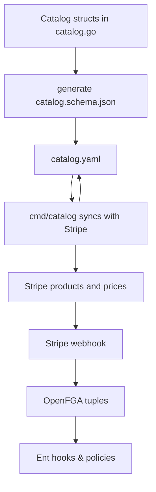

# Catalog

The `catalog` package defines the list of modules and add‑ons that can be purchased in Openlane. These modules are created and added to Stripe subscriptions if the feature is enabled. Each feature describes its billing information and any usage limits that are granted when enabled. Catalog data is stored in [`catalog.yaml`](catalog.yaml) and loaded at runtime to reconcile Stripe products and expose the available modules through the API.

## Overview

A catalog entry contains the following pieces:

* **Modules** – first‑class portions of the platform that customers subscribe to. At least one module is usually required. See the modules vs. addons section for explanation for a comparison with add‑ons.
* **Add‑ons** – optional features that enhance a module. They often provide additional usage or automation in small increments.
* **Billing** – one or more prices for a feature, defined by interval and amount. Prices are matched in Stripe by lookup key and metadata rather than hard coded IDs.
* **Usage** – optional limits (e.g. `evidence_storage_gb`) granted when the feature is enabled.

The package exposes helper functions to load and save catalogs, validate prices against Stripe and ensure any missing products or prices are created. These packages are intended to be used for the Openlane Saas Product, so you would not enable this functionality running it as an open source project. This means that when you run the server WITHOUT the entitlements option enabled, there will be no checks around features, so access to any feature of the platform is not gated separately.

### Flow



## Modules vs. Add‑ons

| Kind       | What it is                                 | Typical price | Core to the product? | UI placement                 | Examples                 |
|------------|--------------------------------------------|---------------|----------------------|------------------------------|--------------------------|
| **module** | A first‑class, standalone slice of the platform. Customers normally subscribe to **at least one** module to get value. | `$20–$100 / mo` | **Yes** – at least one required | Primary cards in signup & pricing page | `compliance`, `trust_center` |
| **addon**  | An optional enhancement that augments a module. Often usage‑based or small flat fee. | `$1–$10 / mo`  | No – opt‑in            | “Extras / Marketplace” or Billing settings | `vanity_domain`, extra seats |

### Why we keep the lists separate

* **Positioning:** Modules appear in marketing copy as base offerings; add‑ons are upsells.
* **Off‑boarding:** Cancelling the last module should close the subscription; removing an add‑on should not.
* **Visibility controls:** Add‑ons are frequently `beta` or `private` audience.
* **Pricing UI:** Front‑end renders modules and add‑ons in distinct sections for clarity.

Implementation‑wise, the two kinds are identical Go structs; the separation only affects UX.


## JSON Schema and Code Generation

Two small utilities live in the [`genjsonschema`](genjsonschema) and [`genyaml`](genyaml) directories.

```bash
go run genjsonschema/catalog_schema.go   # generates genjsonschema/catalog.schema.json
go run genyaml/yamlgen.go                # converts catalog.yaml into Go code
```

The generated JSON schema is used by `LoadCatalog` to validate the YAML format. Running `go generate ./pkg/catalog` (or `task catalog:genjsonschema` and `task catalog:genyaml`) will update both artifacts.

## CLI Utilities

Under [`cmd/catalog`](../../cmd/catalog) are helper commands for working with the catalog and Stripe:

* `catalog` – compares `catalog.yaml` with your Stripe account and optionally creates missing products or prices. Use `--stripe-key` to supply the API key.
* `pricemigrate` – tags a replacement price and can migrate subscriptions from one price ID to another.

These tools are meant for internal maintenance but are useful when seeding a new Stripe environment or validating changes.

## Catalog Versioning

`SaveCatalog` writes the catalog back to disk and manages version bumps. If the contents change, the patch version is incremented and a SHA256 of the version string is stored. This hash is checked by `IsCurrent()` to verify the catalog on disk matches its declared version.

## Example

```go
c, err := catalog.LoadCatalog("./pkg/catalog/catalog.yaml")
if err != nil {
    log.Fatal(err)
}

// Ensure products and prices exist in Stripe and update PriceID fields
if err := c.EnsurePrices(ctx, stripeClient, "usd"); err != nil {
    log.Fatal(err)
}

diff, err := c.SaveCatalog("./pkg/catalog/catalog.yaml")
if err != nil {
    log.Fatal(err)
}
fmt.Println(diff)
```

## Seeding a Stripe Sandbox

If you are just doing local development and **not** changing the catalog, you can use the existing `Sandbox` sandbox and skip the below. If you update your `.config.yaml` with:

```
entConfig:
  modules:
    enabled: true
    useSandbox: true
```

And grab the sandbox api keys, this is already seeded with the existing catalog_sandbox.yaml. Do not commit changes to this file unless they were synced to stripe to allow for multiple users to test in this development environment. If instead, you are doing development on the actual catalog, you should use a new sandbox until the changes are ready to be merged.

Best way to test this setup is to create a new Stripe sandbox, grab the API key, and seed it with your products and prices (creating a new catalog file and removing the existing product ID's and price ID's is best method), similar to below (NOTE: the 404's are intentional, this is a pre-check to ensure the configured catalog doesn't have products and prices in the stripe instance, and that results in 404 errors for "didn't find product and price"):

```bash

(⎈|gke_prod-apps-project_us-central1_prod-central1-core:openlane)➜  core git:(feat-modmodmod) ✗ go run cmd/catalog/main.go --write=true --stripe-key="keyforyoursandboxinstance"
[ERROR] Request error from Stripe (status 404): {"code":"resource_missing","doc_url":"https://stripe.com/docs/error-codes/resource-missing","status":404,"message":"No such product: 'base_module'","param":"id","request_id":"req_eyYmUh5YrY3nAj","request_log_url":"https://dashboard.stripe.com/test/logs/req_eyYmUh5YrY3nAj?t=1752104108","type":"invalid_request_error"}
[ERROR] Request error from Stripe (status 404): {"code":"resource_missing","doc_url":"https://stripe.com/docs/error-codes/resource-missing","status":404,"message":"No such product: 'compliance_module'","param":"id","request_id":"req_NE7xVpjXOw79Ft","request_log_url":"https://dashboard.stripe.com/test/logs/req_NE7xVpjXOw79Ft?t=1752104109","type":"invalid_request_error"}
[ERROR] Request error from Stripe (status 404): {"code":"resource_missing","doc_url":"https://stripe.com/docs/error-codes/resource-missing","status":404,"message":"No such product: 'entity_management_module'","param":"id","request_id":"req_d7iRolDbL2rDDH","request_log_url":"https://dashboard.stripe.com/test/logs/req_d7iRolDbL2rDDH?t=1752104109","type":"invalid_request_error"}
[ERROR] Request error from Stripe (status 404): {"code":"resource_missing","doc_url":"https://stripe.com/docs/error-codes/resource-missing","status":404,"message":"No such product: 'trust_center_module'","param":"id","request_id":"req_9KlgBqR9o6bZU1","request_log_url":"https://dashboard.stripe.com/test/logs/req_9KlgBqR9o6bZU1?t=1752104110","type":"invalid_request_error"}
[ERROR] Request error from Stripe (status 404): {"code":"resource_missing","doc_url":"https://stripe.com/docs/error-codes/resource-missing","status":404,"message":"No such product: 'vulnerability_management_module'","param":"id","request_id":"req_tgnXzB8Uiobzln","request_log_url":"https://dashboard.stripe.com/test/logs/req_tgnXzB8Uiobzln?t=1752104110","type":"invalid_request_error"}
[ERROR] Request error from Stripe (status 404): {"code":"resource_missing","doc_url":"https://stripe.com/docs/error-codes/resource-missing","status":404,"message":"No such product: 'risk_management_addon'","param":"id","request_id":"req_YmIq3oIQv4tlcm","request_log_url":"https://dashboard.stripe.com/test/logs/req_YmIq3oIQv4tlcm?t=1752104111","type":"invalid_request_error"}
[ERROR] Request error from Stripe (status 404): {"code":"resource_missing","doc_url":"https://stripe.com/docs/error-codes/resource-missing","status":404,"message":"No such product: 'domain_scanning_addon'","param":"id","request_id":"req_N27WiPYY0RVzvq","request_log_url":"https://dashboard.stripe.com/test/logs/req_N27WiPYY0RVzvq?t=1752104111","type":"invalid_request_error"}
[ERROR] Request error from Stripe (status 404): {"code":"resource_missing","doc_url":"https://stripe.com/docs/error-codes/resource-missing","status":404,"message":"No such product: 'extra_evidence_storage_addon'","param":"id","request_id":"req_fBB0qDTqfArkGu","request_log_url":"https://dashboard.stripe.com/test/logs/req_fBB0qDTqfArkGu?t=1752104112","type":"invalid_request_error"}
[ERROR] Request error from Stripe (status 404): {"code":"resource_missing","doc_url":"https://stripe.com/docs/error-codes/resource-missing","status":404,"message":"No such product: 'policy_management_addon'","param":"id","request_id":"req_QXl1cBH0M0GhEj","request_log_url":"https://dashboard.stripe.com/test/logs/req_QXl1cBH0M0GhEj?t=1752104112","type":"invalid_request_error"}
┌────────┬─────────────────────────────────┬─────────┬────────────────┐
│ TYPE   │ FEATURE                         │ PRODUCT │ MISSING PRICES │
├────────┼─────────────────────────────────┼─────────┼────────────────┤
│ module │ base_module                     │ false   │ 1              │
├────────┼─────────────────────────────────┼─────────┼────────────────┤
│ module │ compliance_module               │ false   │ 2              │
├────────┼─────────────────────────────────┼─────────┼────────────────┤
│ module │ entity_management_module        │ false   │ 2              │
├────────┼─────────────────────────────────┼─────────┼────────────────┤
│ module │ trust_center_module             │ false   │ 2              │
├────────┼─────────────────────────────────┼─────────┼────────────────┤
│ module │ vulnerability_management_module │ false   │ 2              │
├────────┼─────────────────────────────────┼─────────┼────────────────┤
│ addon  │ domain_scanning_addon           │ false   │ 2              │
├────────┼─────────────────────────────────┼─────────┼────────────────┤
│ addon  │ extra_evidence_storage_addon    │ false   │ 1              │
├────────┼─────────────────────────────────┼─────────┼────────────────┤
│ addon  │ policy_management_addon         │ false   │ 2              │
├────────┼─────────────────────────────────┼─────────┼────────────────┤
│ addon  │ risk_management_addon           │ false   │ 2              │
└────────┴─────────────────────────────────┴─────────┴────────────────┘

Create missing products and prices? (y/N): y
Catalog successfully written to ./pkg/catalog/catalog_sandbox.yaml
Catalog changes:
--- catalog(old)
+++ catalog(new)
@@ -1,5 +1,5 @@
-version: v0.0.5
-sha: d21b9ae3ff2758902ec42e6cc09da842318cc6d71d4d84ba58338a3333eb6685
+version: v0.0.6
+sha: d10bc42ff7f4d2dfbab7e9460d87e79aed1950f6734faf1636ad352f3ac5354b
 modules:
   base_module:
     display_name: Base Module
@@ -7,11 +7,13 @@
     description: Core System Access
     billing:
       prices:
-        - interval: year
-          unit_amount: 0
-          nickname: base_module_free
-          lookup_key: base_module_free
+      - interval: year
+        unit_amount: 0
+        nickname: base_module_free
+        lookup_key: base_module_free
+        price_id: price_1Rj7WKQrAxy77qa7zm8okFhE
     audience: public
+    product_id: prod_SeQNFK7TFhCH5K
     personal_org: true
     include_with_trial: true
   compliance_module:
@@ -20,17 +22,20 @@
     description: Core Compliance Automation and Standards Library
     billing:
       prices:
-        - interval: month
-          unit_amount: 45000
-          nickname: price_compliance_monthly
-          lookup_key: price_compliance_monthly
-        - interval: year
-          unit_amount: 500000
-          nickname: price_compliance_annually
-          lookup_key: price_compliance_annually
+      - interval: month
+        unit_amount: 45000
+        nickname: price_compliance_monthly
+        lookup_key: price_compliance_monthly
+        price_id: price_1Rj7WLQrAxy77qa7TpgKZRK6
+      - interval: year
+        unit_amount: 500000
+        nickname: price_compliance_annually
+        lookup_key: price_compliance_annually
+        price_id: price_1Rj7WLQrAxy77qa7x7I2fIkm
     audience: public
     usage:
       evidence_storage_gb: 25000
+    product_id: prod_SeQNBPhSEM6pZw
     include_with_trial: true
   entity_management_module:
     display_name: Vendor Risk Management
@@ -38,45 +43,54 @@
     description: Vendor Risk Management
     billing:
       prices:
-        - interval: month
-          unit_amount: 20000
-          nickname: price_entity_monthly
-          lookup_key: price_entity_monthly
-        - interval: year
-          unit_amount: 200000
-          nickname: price_vendor_annually
-          lookup_key: price_vendor_annually
+      - interval: month
+        unit_amount: 20000
+        nickname: price_entity_monthly
+        lookup_key: price_entity_monthly
+        price_id: price_1Rj7WMQrAxy77qa7HVbosvRE
+      - interval: year
+        unit_amount: 200000
+        nickname: price_vendor_annually
+        lookup_key: price_vendor_annually
+        price_id: price_1Rj7WNQrAxy77qa7PO4XII8e
     audience: private
+    product_id: prod_SeQN9eOdITFyEL
   trust_center_module:
     display_name: Trust Center
     lookup_key: trust_center_module
     description: Public Security Portal
     billing:
       prices:
-        - interval: month
-          unit_amount: 30000
-          nickname: price_trustcenter_monthly
-          lookup_key: price_trustcenter_monthly
-        - interval: year
-          unit_amount: 300000
-          nickname: price_trustcenter_annually
-          lookup_key: price_trustcenter_annually
+      - interval: month
+        unit_amount: 30000
+        nickname: price_trustcenter_monthly
+        lookup_key: price_trustcenter_monthly
+        price_id: price_1Rj7WGQrAxy77qa7vP3pArda
+      - interval: year
+        unit_amount: 300000
+        nickname: price_trustcenter_annually
+        lookup_key: price_trustcenter_annually
+        price_id: price_1Rj7WGQrAxy77qa7e13ilZYl
     audience: beta
+    product_id: prod_SeQMrqIdGRyzOo
   vulnerability_management_module:
     display_name: Vulnerability Tracking and Management
     lookup_key: vulnerability_management_module
     description: Vulnerability Tracking and Management
     billing:
       prices:
-        - interval: month
-          unit_amount: 10000
-          nickname: price_vulnerability_mgmt_monthly
-          lookup_key: price_vulnerability_mgmt_monthly
-        - interval: year
-          unit_amount: 100000
-          nickname: price_vulnerability_mgmt_annually
-          lookup_key: price_vulnerability_mgmt_annually
+      - interval: month
+        unit_amount: 10000
+        nickname: price_vulnerability_mgmt_monthly
+        lookup_key: price_vulnerability_mgmt_monthly
+        price_id: price_1Rj7WIQrAxy77qa7iq26LyGr
+      - interval: year
+        unit_amount: 100000
+        nickname: price_vulnerability_mgmt_annually
+        lookup_key: price_vulnerability_mgmt_annually
+        price_id: price_1Rj7WIQrAxy77qa7HjEXbA99
     audience: private
+    product_id: prod_SeQN6ZyE2ssUjw
 addons:
   domain_scanning_addon:
     display_name: Domain and Vulnerability Scanning
@@ -84,56 +98,67 @@
     description: Domain and Vulnerability Scanning
     billing:
       prices:
-        - interval: month
-          unit_amount: 10000
-          nickname: domain_scan_monthly
-          lookup_key: domain_scan_monthly
-        - interval: year
-          unit_amount: 100000
-          nickname: domain_scan_annually
-          lookup_key: domain_scan_annually
+      - interval: month
+        unit_amount: 10000
+        nickname: domain_scan_monthly
+        lookup_key: domain_scan_monthly
+        price_id: price_1Rj7WOQrAxy77qa7bpyEd7JH
+      - interval: year
+        unit_amount: 100000
+        nickname: domain_scan_annually
+        lookup_key: domain_scan_annually
+        price_id: price_1Rj7WPQrAxy77qa7AQ4HKz4K
     audience: private
+    product_id: prod_SeQNr2n1jkKU6t
   extra_evidence_storage_addon:
     display_name: Additional Evidence Storage (100GB)
     lookup_key: extra_evidence_storage_addon
     description: Additional Evidence Storage for Compliance Evidence and Documents (100GB)
     billing:
       prices:
-        - interval: month
-          unit_amount: 1000
-          nickname: extra_evidence_storage_100gb
-          lookup_key: extra_evidence_storage_100gb
-          metadata:
-            increment_gb: "100"
+      - interval: month
+        unit_amount: 1000
+        nickname: extra_evidence_storage_100gb
+        lookup_key: extra_evidence_storage_100gb
+        metadata:
+          increment_gb: "100"
+        price_id: price_1Rj7WQQrAxy77qa7Da7Wiog7
     audience: public
+    product_id: prod_SeQNyCrFdvkB0N
   policy_management_addon:
     display_name: Policy and Procedure Management
     lookup_key: policy_management_addon
     description: Policy and Procedure Management
     billing:
       prices:
-        - interval: month
-          unit_amount: 1000
-          nickname: price_policy_mgmt_monthly
-          lookup_key: price_policy_mgmt_monthly
-        - interval: month
-          unit_amount: 10000
-          nickname: price_policy_mgmt_annually
-          lookup_key: price_policy_mgmt_annually
+      - interval: month
+        unit_amount: 1000
+        nickname: price_policy_mgmt_monthly
+        lookup_key: price_policy_mgmt_monthly
+        price_id: price_1Rj7WRQrAxy77qa7XAoCYdml
+      - interval: month
+        unit_amount: 10000
+        nickname: price_policy_mgmt_annually
+        lookup_key: price_policy_mgmt_annually
+        price_id: price_1Rj7WSQrAxy77qa73XxQP7b1
     audience: beta
+    product_id: prod_SeQNZsEGuTWqd6
   risk_management_addon:
     display_name: Risk Management
     lookup_key: risk_management_addon
     description: Risk Management
     billing:
       prices:
-        - interval: month
-          unit_amount: 1000
-          nickname: price_risk_mgmt_monthly
-          lookup_key: price_risk_mgmt_monthly
-        - interval: year
-          unit_amount: 10000
-          nickname: price_risk_mgmt_annually
-          lookup_key: price_risk_mgmt_annually
+      - interval: month
+        unit_amount: 1000
+        nickname: price_risk_mgmt_monthly
+        lookup_key: price_risk_mgmt_monthly
+        price_id: price_1Rj7WTQrAxy77qa7qCaZQUYK
+      - interval: year
+        unit_amount: 10000
+        nickname: price_risk_mgmt_annually
+        lookup_key: price_risk_mgmt_annually
+        price_id: price_1Rj7WTQrAxy77qa7QwqyTYwu
     audience: beta
+    product_id: prod_SeQNAVomfOKW6D

```
