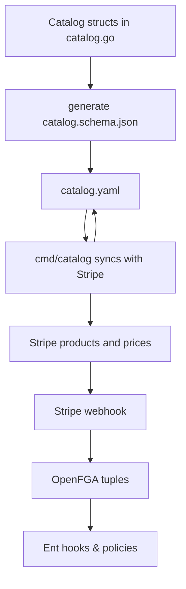

# Catalog

The `catalog` package defines the list of modules and add‑ons that can be purchased in Openlane. These modules are created and added to Stripe subscriptions if the feature is enabled. Each feature describes its billing information and any usage limits that are granted when enabled. Catalog data is stored in [`catalog.yaml`](catalog.yaml) and loaded at runtime to reconcile Stripe products and expose the available modules through the API.

## Overview

A catalog entry contains the following pieces:

* **Modules** – first‑class portions of the platform that customers subscribe to. At least one module is usually required. See the modules vs. addons section for explanation for a comparison with add‑ons.
* **Add‑ons** – optional features that enhance a module. They often provide additional usage or automation in small increments.
* **Billing** – one or more prices for a feature, defined by interval and amount. Prices are matched in Stripe by lookup key and metadata rather than hard coded IDs.
* **Usage** – optional limits (e.g. `evidence_storage_gb`) granted when the feature is enabled.

The package exposes helper functions to load and save catalogs, validate prices against Stripe and ensure any missing products or prices are created. These packages are intended to be used for the Openlane Saas Product, so you would not enable this functionality running it as an open source project. This means that when you run the server WITHOUT the entitlements option enabled, there will be no checks around features, so access to any feature of the platform is not gated separately.

### Flow



## Modules vs. Add‑ons

| Kind       | What it is                                 | Typical price | Core to the product? | UI placement                 | Examples                 |
|------------|--------------------------------------------|---------------|----------------------|------------------------------|--------------------------|
| **module** | A first‑class, standalone slice of the platform. Customers normally subscribe to **at least one** module to get value. | `$20–$100 / mo` | **Yes** – at least one required | Primary cards in signup & pricing page | `compliance`, `trust_center` |
| **addon**  | An optional enhancement that augments a module. Often usage‑based or small flat fee. | `$1–$10 / mo`  | No – opt‑in            | “Extras / Marketplace” or Billing settings | `vanity_domain`, extra seats |

### Why we keep the lists separate

* **Positioning:** Modules appear in marketing copy as base offerings; add‑ons are upsells.
* **Off‑boarding:** Cancelling the last module should close the subscription; removing an add‑on should not.
* **Visibility controls:** Add‑ons are frequently `beta` or `private` audience.
* **Pricing UI:** Front‑end renders modules and add‑ons in distinct sections for clarity.

Implementation‑wise, the two kinds are identical Go structs; the separation only affects UX.


## JSON Schema and Code Generation

Two small utilities live in the [`genjsonschema`](genjsonschema) and [`genyaml`](genyaml) directories.

```bash
go run genjsonschema/catalog_schema.go   # generates genjsonschema/catalog.schema.json
go run genyaml/yamlgen.go                # converts catalog.yaml into Go code
```

The generated JSON schema is used by `LoadCatalog` to validate the YAML format. Running `go generate ./pkg/catalog` (or `task catalog:genjsonschema` and `task catalog:genyaml`) will update both artifacts.

## CLI Utilities

Under [`cmd/catalog`](../../cmd/catalog) are helper commands for working with the catalog and Stripe:

* `catalog` – compares `catalog.yaml` with your Stripe account and optionally creates missing products or prices. Use `--stripe-key` to supply the API key.
* `pricemigrate` – tags a replacement price and can migrate subscriptions from one price ID to another.

These tools are meant for internal maintenance but are useful when seeding a new Stripe environment or validating changes.

## Catalog Versioning

`SaveCatalog` writes the catalog back to disk and manages version bumps. If the contents change, the patch version is incremented and a SHA256 of the version string is stored. This hash is checked by `IsCurrent()` to verify the catalog on disk matches its declared version.

## Example

```go
c, err := catalog.LoadCatalog("./pkg/catalog/catalog.yaml")
if err != nil {
    log.Fatal(err)
}

// Ensure products and prices exist in Stripe and update PriceID fields
if err := c.EnsurePrices(ctx, stripeClient, "usd"); err != nil {
    log.Fatal(err)
}

diff, err := c.SaveCatalog("./pkg/catalog/catalog.yaml")
if err != nil {
    log.Fatal(err)
}
fmt.Println(diff)
```
