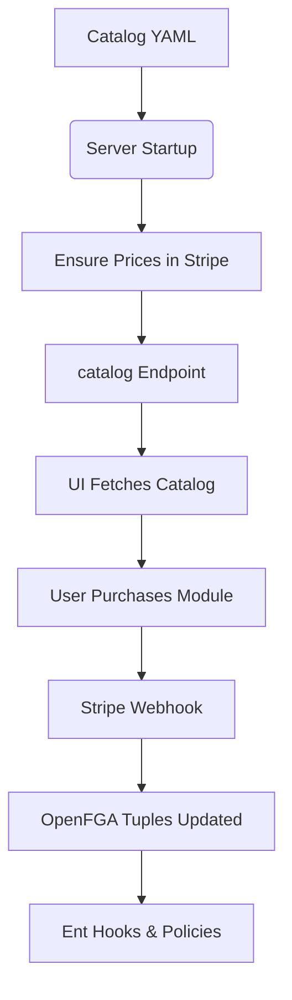
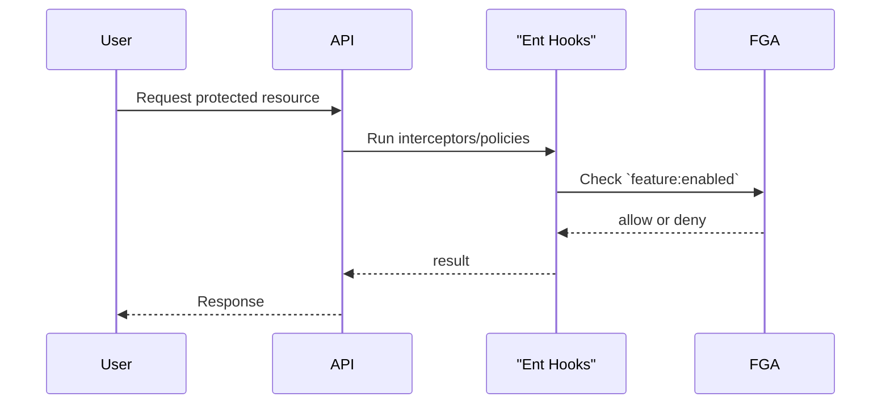

# Entitlements and Modules

## Module Catalog

Available modules and add-ons are defined in `config/catalog.example.yaml`.
The server loads this file at startup (see `moduleCatalogFile` in
`config/config.example.yaml`) and watches for changes. Updates to the file are
applied automatically without a restart.

The `/v1/catalog` endpoint exposes the visible catalog to the UI. The audience
field controls if a module is `public`, `beta`, or `private`.

Each feature's `billing.prices` section enumerates Stripe prices for that
feature. Prices are matched by interval, amount, nickname, lookup key, and
metadata rather than a fixed ID. During server startup (and whenever the catalog file is
reloaded) missing products and prices are created automatically and tagged with
`managed_by: module-manager` so they can be distinguished from manual entries.

Modules may define usage limits like `evidence_storage_gb` that grant resources
when the feature is enabled. Add-ons can extend these limits incrementally.

#### End‑to‑End Flow

The following diagram shows how modules flow from configuration to
authorization:

1. **Catalog YAML** defines modules, add‑ons and pricing.
2. On server startup the catalog is loaded and any missing Stripe prices are
   created.
3. `/v1/catalog` exposes the catalog so the UI can display purchasable modules.
4. When a module is purchased the Stripe webhook updates the organization’s
   feature tuples in openFGA.
5. Ent hooks and privacy rules consult these tuples to allow or deny access to
   functionality. Enabled features are cached in the same Redis instance used
   for session storage for five minutes to minimize calls to OpenFGA while
   keeping it as the source of truth.

You can verify your configuration without modifying Stripe by running
`go run ./cmd/catalog`. This CLI loads the catalog and reports which
products and prices already exist.  The catalog format itself is described by
`jsonschema/catalog.schema.json` so you can lint changes with any JSON Schema
validator.

### Why not store features in the session?

Storing feature data directly inside the session or embedding it into issued
JWTs might seem convenient, but it introduces significant lifecycle concerns.
Tokens often remain valid for hours or days; if a subscription changes during
that time the token would become stale until the user reauthenticates. By
keeping feature lists in their own Redis cache we can update entitlements
immediately while still sharing the same Redis infrastructure as the session
store. Sessions stay lightweight and users do not need to log back in when
their organization gains or loses modules.

### Feature Annotations

Ent schemas can optionally declare which modules enable their functionality
using annotations from `pkg/features`.  For example,
`features.Requires("compliance-module")` ties a schema to the compliance
module while `features.Base()` marks core or internal schemas that bypass module checks.
Multiple modules can be listed to allow access if *any* are enabled,
e.g. `features.Requires("compliance-module", "trust-center")`.
Policies and interceptors can inspect these annotations to enforce access.
Running `go generate ./ent/generate` produces a `features_gen.go`
file inside `ent/generated` mapping schemas to required modules. This
mapping can be imported by privacy rules or interceptors to apply checks based
on the annotations.

#### Entitlement Check Flow

