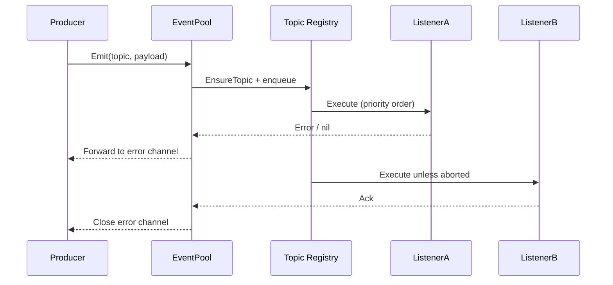

# Soiree

Soiree is an event coordination toolkit that wraps listener registration, execution order, retries, and persistence behind a small API. It is built around an `EventPool` that manages topics and listeners, optionally fans work out to a worker pool, and surfaces rich context to handlers through `EventContext`.

The package underpins our ent mutation hooks, but it is intentionally framework‑agnostic and can be embedded anywhere ordinary Go code needs structured asynchronous notifications.

## Key Concepts

- **EventPool** – runtime broker that owns topics, manages listener registration, and executes handlers (optionally via a goroutine pool).
- **Topics** – logical channels identified by string names; priorities determine listener execution order within a topic.
- **Listeners** – functions that consume an `*EventContext`; they may inspect payloads, mutate properties, abort delivery, or access the originating client.
- **Stores & Retries** – optional pluggable persistence and retry policies (e.g., Redis queue with exponential backoff).
- **Typed Topics** – helpers that wrap/unwrap strongly typed payloads so handlers work with domain objects instead of raw `any`.

## Quick Start

```go
package main

import (
	"fmt"

	"github.com/theopenlane/core/pkg/events/soiree"
)

func main() {
	pool := soiree.NewEventPool()
	const topic = "user.created"

	_, err := pool.On(topic, func(ctx *soiree.EventContext) error {
		name, _ := ctx.PropertyString("name")
		fmt.Printf("welcome %s (payload: %v)\n", name, ctx.Payload())
		return nil
	})
	if err != nil {
		panic(err)
	}

	event := soiree.NewBaseEvent(topic, map[string]string{"email": "user@example.com"})
	event.Properties().Set("name", "Ada Lovelace")

	for err := range pool.Emit(topic, event) {
		if err != nil {
			fmt.Printf("listener error: %v\n", err)
		}
	}
}
```

## Typed Topics

The `topics_typed.go` helpers let you bind strongly typed payloads while still benefiting from pooled execution:

```go
userTopic := soiree.NewTypedTopic(
	"user.created",
	func(payload UserEvent) soiree.Event { return soiree.NewBaseEvent("user.created", payload) },
	func(evt soiree.Event) (UserEvent, error) {
		payload, ok := evt.Payload().(UserEvent)
		if !ok {
			return UserEvent{}, fmt.Errorf("unexpected payload %T", evt.Payload())
		}
		return payload, nil
	},
)

binding := soiree.BindListener(userTopic, func(ctx *soiree.EventContext, payload UserEvent) error {
	ctx.SetProperty("user_id", payload.ID)
	return nil
})

pool := soiree.NewEventPool()
if _, err := pool.RegisterListeners(binding); err != nil {
	panic(err)
}
```

## EventContext Cheat Sheet

| Method | Purpose |
| --- | --- |
| `Context()` | Returns the request context associated with the event. |
| `Payload()` / `PayloadAs[T]` | Access the raw or typed payload. |
| `Properties()` / `PropertyString` | Inspect or mutate ad‑hoc metadata shared across listeners. |
| `Client()` / `ClientAs[T]` | Retrieve the client attached to the event (e.g., an ent client). |
| `Abort()` / `Event().SetAborted(true)` | Stop further listener execution for the current event. |

## Configuration Options

Use functional options with `NewEventPool` to customise behavior:

| Option | Description |
| --- | --- |
| `WithPool` | Run listeners on a shared goroutine pool (default is per‑listener goroutines). Use `soiree.NewPondPool` for a preconfigured [pond](https://github.com/alitto/pond) worker pool. |
| `WithErrorHandler` | Override how handler errors are processed before they reach the caller. |
| `WithPanicHandler` | Centralise panic recovery logic. |
| `WithIDGenerator` | Supply custom listener IDs (e.g., UUIDs). |
| `WithEventStore` / `WithRedisStore` | Persist events and handler outcomes; enables queue replay. |
| `WithRetry` | Configure retry attempts and backoff policy for failing listeners. |
| `WithErrChanBufferSize` | Resize the buffered error channel returned by `Emit`. |
| `WithClient` | Attach an arbitrary client object that is then available to listeners. |

For pool tuning guidance review the pond documentation: <https://github.com/alitto/pond>.

## Lifecycle Flow



## ent Integration

`internal/ent/hooks` wires Soiree into ent mutations via the `Eventer`. The hook:

1. Determines whether any listeners are registered for the entity’s topic (including dynamic registrations on the pool).
1. Marshals the mutation payload (operation, entity ID, and ent client) into a strongly typed event.
1. Emits after commit (or immediately for non‑transactional operations).

If you add listeners directly to the pool (e.g., in tests or feature toggles), they are still honored because the hook checks the live pool state before deciding to emit.

### Adding a new ent mutation listener

**Define the handler**

Implement a `hooks.MutationHandler` in `internal/ent/hooks`. Handlers receive a `*soiree.EventContext` and `*hooks.MutationPayload`; they can access the ent client via `payload.Client` or `soiree.ClientAs`.

**Register the listener**

Use `eventer.AddMutationListener(<entity>, handler, opts...)`, typically in `registerDefaultMutationListeners` or wherever the feature is initialised. Supply priorities/pre-hooks/post-hooks as needed.

**Ensure emission**

The ent hook emits automatically once the listener is registered. If you need a new topic name, rely on the entity’s schema type (e.g., `entgen.TypeOrganization`) so `mutationTopic` produces a consistent topic.

**Test the flow**

- Unit tests: construct an `Eventer` with `NewEventer(WithEventerEmitter(soiree.NewEventPool()))`, register your listener, and invoke the handler with a fake mutation payload.
- Integration tests: exercise the ent mutation (GraphQL or REST) and assert on side effects, inspecting events via captured mocks or the listener itself.

#### Practical example

```go
// internal/ent/hooks/listeners_billing.go
func handleOrganizationBillingUpdate(ctx *soiree.EventContext, payload *hooks.MutationPayload) error {
	if payload.Operation != ent.OpUpdateOne.String() {
		return nil
	}

	inv, ok := newEntitlementInvocation(ctx, payload, orgAllowContext)
	if !ok {
		return nil
	}

	return inv.reconcile()
}

// internal/ent/hooks/eventer.go
func registerDefaultMutationListeners(e *Eventer) {
	// existing listeners…
	e.AddMutationListener(entgen.TypeOrganizationSetting, handleOrganizationBillingUpdate)
}
```

Unit test pattern:

```go
func TestHandleOrganizationBillingUpdate(t *testing.T) {
	pool := soiree.NewEventPool()
	eventer := NewEventer(WithEventerEmitter(pool))
	eventer.AddMutationListener(entgen.TypeOrganizationSetting, handleOrganizationBillingUpdate)

	payload := &hooks.MutationPayload{
		Operation: ent.OpUpdateOne.String(),
		EntityID:  "org-setting-id",
		Client:    fakeEntClient(t), // supply test double
	}

	ctx := context.Background()
	event := soiree.NewBaseEvent(entgen.TypeOrganizationSetting, payload)
	event.SetContext(ctx)

	errs := pool.EmitSync(event.Topic(), event)
	require.Empty(t, errs)
	// assert on fakeEntClient interactions…
}
```

End-to-end tests can exercise the actual ent mutation (GraphQL/REST) and assert on downstream effects (e.g., Stripe updates) once the listener runs.

## Examples

Each example is guarded by `//go:build examples`. Run one with:

```
go run -tags examples ./pkg/events/soiree/examples/<name>
```

- `error-handling` – custom error handler demonstrating centralised logging.
- `metrics` – attaches a pond worker pool, exposes Prometheus metrics, and drives concurrent emits.
- `ordering` – prioritised listeners and event abortion.
- `panics` – custom panic handler that keeps the producer alive.
- `redis` – Redis-backed queue with retry policy.
- `uniqueID` – overrides listener ID generation.

Simpler duplicates have been removed; the remaining samples cover the full API surface area.
