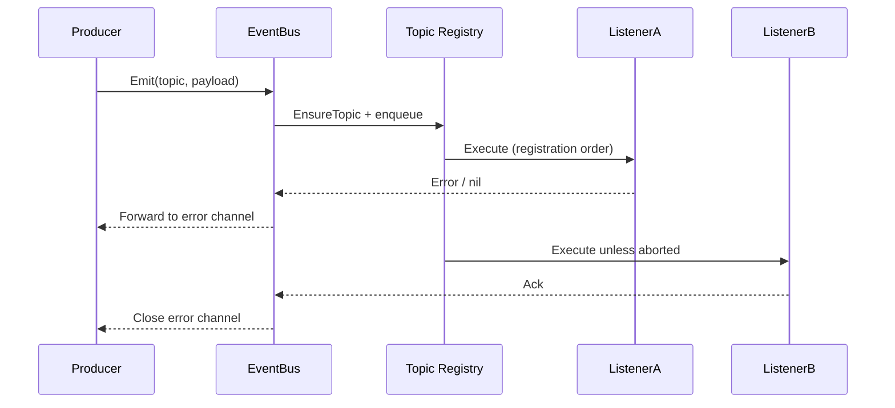

# Soiree

Soiree is an event coordination toolkit that wraps listener registration, execution order, retries, and persistence behind a small API. It is built around an `EventBus` that manages topics and listeners, uses a worker pool (default 10 workers), and surfaces rich context to handlers through `EventContext`.

The package underpins our ent mutation hooks, but it is intentionally framework-agnostic and can be embedded anywhere ordinary Go code needs structured asynchronous notifications.

## Key Concepts

- **EventBus** - runtime broker that owns topics, manages listener registration, and executes handlers on a worker pool.
- **Topics** - logical channels identified by string names; wildcard patterns are supported, more specific patterns run first, and listeners run in registration order within each topic.
- **Listeners** - functions that consume an `*EventContext`; they can inspect/mutate properties and access the originating client. Use typed topics when you need payload access.
- **Stores & Retries** - optional pluggable persistence and retry policies (e.g., Redis queue with exponential backoff).
- **Typed Topics** - helpers that wrap/unwrap strongly typed payloads so handlers work with domain objects instead of raw `any`.

## Quick Start

```go
package main

import (
	"fmt"

	"github.com/theopenlane/core/pkg/events/soiree"
)

func main() {
	bus := soiree.New()
	const topic = "user.created"

	_, err := bus.On(topic, func(ctx *soiree.EventContext) error {
		name, _ := ctx.PropertyString("name")
		fmt.Printf("welcome %s\n", name)
		return nil
	})
	if err != nil {
		panic(err)
	}

	event := soiree.NewBaseEvent(topic, map[string]string{"email": "user@example.com"})
	event.Properties().Set("name", "Ada Lovelace")

	for err := range bus.Emit(event.Topic(), event) {
		if err != nil {
			fmt.Printf("listener error: %v\n", err)
		}
	}
}
```

Need payload access? Bind a typed listener (see below) so your handler receives the payload directly.

## Typed Topics

The `topics_typed.go` helpers let you bind strongly typed payloads while still benefiting from pooled execution:

```go
// Simple: just specify the type and topic name - wrap/unwrap are provided automatically
userTopic := soiree.NewTypedTopic[UserEvent]("user.created")

binding := soiree.BindListener(userTopic, func(ctx *soiree.EventContext, payload UserEvent) error {
	ctx.Properties().Set("user_id", payload.ID)
	return nil
})

bus := soiree.New()
if _, err := bus.RegisterListeners(binding); err != nil {
	panic(err)
}

event, err := userTopic.Wrap(UserEvent{ID: "user-123"})
if err != nil {
	panic(err)
}
for err := range bus.Emit(userTopic.Name(), event) {
	if err != nil {
		fmt.Printf("listener error: %v\n", err)
	}
}
```

For custom wrap/unwrap logic, use functional options:

```go
userTopic := soiree.NewTypedTopic[UserEvent](
	"user.created",
	soiree.WithUnwrap(func(evt soiree.Event) (UserEvent, error) {
		payload, ok := evt.Payload().(UserEvent)
		if !ok {
			return UserEvent{}, fmt.Errorf("unexpected payload %T", evt.Payload())
		}
		return payload, nil
	}),
)
```

## EventContext Cheat Sheet

| Method | Purpose |
| --- | --- |
| `Context()` | Returns the request context associated with the event. |
| `Event()` / `Payload()` / `PayloadAs[T](ctx)` | Access the underlying event or payload. |
| `Properties()` / `Property` / `PropertyString` | Inspect or mutate ad-hoc metadata shared across listeners. |
| `ClientAs[T](ctx)` | Retrieve the client attached to the event (e.g., an ent client). |

Use typed topics to access event payloads inside listeners.

## Configuration Options

Use functional options with `New` to customise behavior:

| Option | Description |
| --- | --- |
| `Workers` | Resize the worker pool used by emitted events (default is 10 workers). |
| `ErrorHandler` | Override how handler errors are processed before they reach the caller. |
| `Panics` | Centralize panic recovery logic. |
| `IDGenerator` | Supply custom listener/event IDs (e.g., UUIDs). |
| `EventStore` / `WithRedisStore` | Persist events and handler outcomes; queue stores enable replay. |
| `Retry` | Configure retry attempts and backoff policy for failing listeners. |
| `ErrChanBufferSize` | Resize the buffered error channel returned by `Emit`. |
| `Client` | Attach an arbitrary client object that is then available to listeners. |

`Emit` runs listeners on the worker pool; drain the returned channel to block inline.

Need a standalone pool (for non-EventBus concurrency)? Use `soiree.NewPool(soiree.WithWorkers(n))`. Pool metrics are registered on the Prometheus default registerer with a `pool` label; override with `soiree.WithPoolMetricsRegisterer(reg)` and `soiree.WithPoolName(name)`.

For pool tuning guidance review the pond documentation: <https://github.com/alitto/pond>.

## Lifecycle Flow



## ent Integration

`internal/ent/hooks` wires Soiree into ent mutations via the `Eventer`. The hook:

1. Determines whether any listeners are registered for the entity’s topic (including dynamic registrations on the pool).
1. Marshals the mutation payload (operation, entity ID, and ent client) into a strongly typed event.
1. Emits after commit (or immediately for non‑transactional operations).

If you add listeners directly to the bus (e.g., in tests or feature toggles), they are still honored because the hook checks the live bus state before deciding to emit.

### Adding a new ent mutation listener

**Define the handler**

Implement a `hooks.MutationHandler` in `internal/ent/hooks`. Handlers receive a `*soiree.EventContext` and `*hooks.MutationPayload`; they can access the ent client via `payload.Client` or `soiree.ClientAs`.

**Register the listener**

Use `eventer.AddMutationListener(<entity>, handler, opts...)`, typically in `registerDefaultMutationListeners` or wherever the feature is initialised. Supply priorities/pre-hooks/post-hooks as needed.

**Ensure emission**

The ent hook emits automatically once the listener is registered. If you need a new topic name, rely on the entity’s schema type (e.g., `entgen.TypeOrganization`) so `mutationTopic` produces a consistent topic.

**Test the flow**

- Unit tests: construct an `Eventer` with `NewEventer(WithEventerEmitter(soiree.New()))`, register your listener, and invoke the handler with a fake mutation payload.
- Integration tests: exercise the ent mutation (GraphQL or REST) and assert on side effects, inspecting events via captured mocks or the listener itself.

#### Practical example

```go
// internal/ent/hooks/listeners_billing.go
func handleOrganizationBillingUpdate(ctx *soiree.EventContext, payload *hooks.MutationPayload) error {
	if payload.Operation != ent.OpUpdateOne.String() {
		return nil
	}

	inv, ok := newEntitlementInvocation(ctx, payload, orgAllowContext)
	if !ok {
		return nil
	}

	return inv.reconcile()
}

// internal/ent/hooks/eventer.go
func registerDefaultMutationListeners(e *Eventer) {
	// existing listeners…
	e.AddMutationListener(entgen.TypeOrganizationSetting, handleOrganizationBillingUpdate)
}
```

Unit test pattern:

```go
func TestHandleOrganizationBillingUpdate(t *testing.T) {
	bus := soiree.New()
	eventer := NewEventer(WithEventerEmitter(bus))
	eventer.AddMutationListener(entgen.TypeOrganizationSetting, handleOrganizationBillingUpdate)

	payload := &hooks.MutationPayload{
		Operation: ent.OpUpdateOne.String(),
		EntityID:  "org-setting-id",
		Client:    fakeEntClient(t), // supply test double
	}

	ctx := context.Background()
	event := soiree.NewBaseEvent(entgen.TypeOrganizationSetting, payload)
	event.SetContext(ctx)

	var errs []error
	for err := range bus.Emit(event.Topic(), event) {
		if err != nil {
			errs = append(errs, err)
		}
	}
	require.Empty(t, errs)
	// assert on fakeEntClient interactions…
}
```

End-to-end tests can exercise the actual ent mutation (GraphQL/REST) and assert on downstream effects (e.g., Stripe updates) once the listener runs.
