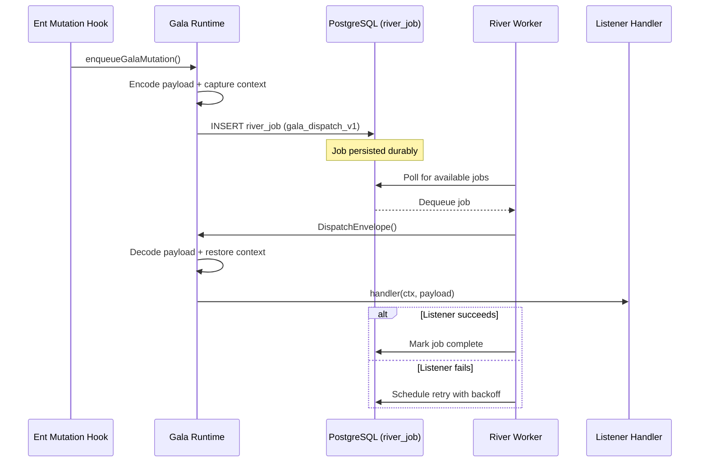
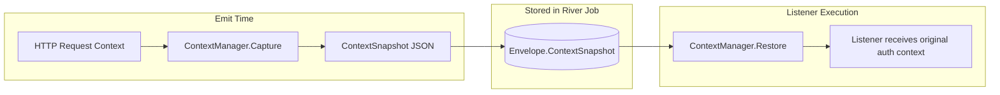

# Gala

Gala is a durable event dispatch system built on [River](https://riverqueue.com). It replaces the in-memory `pkg/soiree` with PostgreSQL-backed job persistence, automatic retries, and multi-instance scaling.

Events emitted through Gala survive process restarts, pod evictions, and deployment rollouts. When a listener fails, River retries the job with backoff until it succeeds or exhausts configured attempts.

## How It Works



The entire envelope (payload, headers, context snapshot) is JSON-serialized into a single `river_job` row. This means your event data lives in the same PostgreSQL database as your application data, simplifying operational concerns.

## Defining Topics and Listeners

A topic is a named channel for events of a specific payload type. The generic type parameter enforces compile-time type safety between emitters and listeners.

```go
// Define your payload type
type InvoiceCreated struct {
    InvoiceID  string `json:"invoice_id"`
    CustomerID string `json:"customer_id"`
    Amount     int64  `json:"amount_cents"`
}

// Define the topic with its payload type
var invoiceCreatedTopic = gala.Topic[InvoiceCreated]{
    Name: "billing.invoice.created",
}
```

Register listeners using `RegisterListeners`, which handles topic registration automatically:

```go
func RegisterBillingListeners(registry *gala.Registry) ([]gala.ListenerID, error) {
    return gala.RegisterListeners(registry,
        gala.Definition[InvoiceCreated]{
            Topic: invoiceCreatedTopic,
            Name:  "billing.invoice.send-receipt",
            Handle: func(ctx gala.HandlerContext, payload InvoiceCreated) error {
                // Access dependencies via the injector
                mailer, err := do.Invoke[*email.Client](ctx.Injector)
                if err != nil {
                    return err
                }
                return mailer.SendReceipt(ctx.Context, payload.CustomerID, payload.InvoiceID)
            },
        },
        gala.Definition[InvoiceCreated]{
            Topic: invoiceCreatedTopic,
            Name:  "billing.invoice.update-metrics",
            Handle: func(ctx gala.HandlerContext, payload InvoiceCreated) error {
                metrics.InvoicesCreated.Inc()
                return nil
            },
        },
    )
}
```

### Operation Filtering

For mutation-style payloads with an `Operation` field, listeners can filter by operation type:

```go
gala.Definition[eventqueue.MutationGalaPayload]{
    Topic: gala.Topic[eventqueue.MutationGalaPayload]{
        Name: "Organization",
    },
    Name:       "entitlements.organization.create",
    Operations: []string{ent.OpCreate.String()},  // Only handle creates
    Handle:     handleOrganizationCreated,
}
```

## Emitting Events

For direct emission (outside the mutation hook flow):

```go
receipt := galaApp.EmitWithHeaders(ctx, invoiceCreatedTopic.Name, InvoiceCreated{
    InvoiceID:  "inv_123",
    CustomerID: "cus_456",
    Amount:     9900,
}, gala.Headers{
    IdempotencyKey: "inv_123", // Enables replay-safe consumption
})

if receipt.Err != nil {
    return receipt.Err
}
```

Most events in the codebase flow through the ent mutation hook (`EmitGalaEventHook`), which automatically builds and emits `MutationGalaPayload` envelopes after successful commits.

## Codecs: Type-Safe Serialization

Codecs handle the serialization boundary between your Go types and the JSON stored in River jobs. Every topic registration requires a codec:

```go
type Codec[T any] interface {
    Encode(T) ([]byte, error)
    Decode([]byte) (T, error)
}
```

The built-in `JSONCodec[T]` handles standard JSON marshaling and is the default for most use cases. Custom codecs are useful when you need:

- Non-JSON formats (protobuf, msgpack)
- Encryption at rest for sensitive payloads
- Schema migration or backwards compatibility handling

```go
gala.RegisterTopic(registry, gala.Registration[InvoiceCreated]{
    Topic: invoiceCreatedTopic,
    Codec: gala.JSONCodec[InvoiceCreated]{}, // Default JSON codec
})
```

When using `RegisterListeners`, topics are auto-registered with `JSONCodec`.

## Context Propagation

Gala snapshots context values at emit time and restores them when the listener executes. This happens transparently for caller context (`auth.Caller`), so listeners can access the original caller identity and capabilities even when processing asynchronously.



### Context Flags

For boolean signals that need to propagate (like workflow bypass flags):

```go
// At emit time
ctx = gala.WithFlag(ctx, gala.ContextFlagWorkflowBypass)

// In listener
if gala.HasFlag(ctx.Context, gala.ContextFlagWorkflowBypass) {
    // Skip workflow processing
}
```

## Dependency Injection

Listeners receive a `HandlerContext` with a `do.Injector` for resolving dependencies. Dependencies are registered at startup:

```go
// During server initialization
do.ProvideValue(runtime.Injector(), dbClient)                    // *generated.Client
do.ProvideValue(runtime.Injector(), dbClient.EntitlementManager) // you could access via the dbclient -> *entitlements.StripeClient
do.ProvideNamedValue(runtime.Injector(), "stripe_client", stripeClient) // you can also access the client directly
do.ProvideValue(runtime.Injector(), dbClient.TokenManager)       // *tokens.TokenManager
do.ProvideValue(runtime.Injector(), wfEngine)                    // *engine.WorkflowEngine

// In listener
func handle(ctx gala.HandlerContext, payload MyPayload) error {
	// now you can profit from the injected type
	stripeClient, err := do.InvokeNamed[*stripe.Client](ctx.Injector, "stripe_client")
	if err != nil {
		return err
	}

	client, err := do.Invoke[*generated.Client](ctx.Injector)
	if err != nil {
		return err
	}

	// use the clients

	return nil
}
```

This avoids global state and makes listeners testable with mock dependencies.

## Durability and Retries

Gala's durability comes from River, which stores jobs in PostgreSQL. Key characteristics:

| Aspect | Behavior |
|--------|----------|
| **Storage** | Jobs stored in `river_job` table alongside application data |
| **Delivery** | At-least-once (use `IdempotencyKey` for exactly-once semantics) |
| **Retries** | Configurable via `Config.MaxRetries`, exponential backoff |
| **Scaling** | Multiple workers poll the same queue; work distributed automatically |
| **Ordering** | No ordering guarantees across events; order preserved within single event's listeners |

When a listener returns an error, the job is rescheduled for retry. Panics are recovered and converted to errors, triggering the same retry behavior.

## Server Integration

The standard setup in `serveropts`:

```go
galaApp, err := gala.NewGala(ctx, gala.Config{
    ConnectionURI: jobQueueConnectionURI,
    QueueName:     "events",     // River queue name
    WorkerCount:   10,           // Concurrent workers polling this queue
    MaxRetries:    5,            // Retry attempts before marking failed
})
if err != nil {
    return err
}

// Register dependencies for listeners
do.ProvideValue(galaApp.Injector(), dbClient)

// Register listeners
hooks.RegisterGalaSlackListeners(galaApp.Registry())

// Start workers
if err := galaApp.StartWorkers(ctx); err != nil {
    return err
}

// On shutdown
defer galaApp.StopWorkers(ctx)
defer galaApp.Close()
```

## Concurrency Model

```
Event A ──► Worker 1 ──► Listener executes
Event B ──► Worker 2 ──► Listener executes
Event C ──► Worker 3 ──► Listener executes
   ...         ...
```

With `WorkerCount: 100`, up to 100 events process concurrently. Each event's listener(s) execute sequentially within their worker, providing:

- Predictable execution order within a single event
- Simple error/retry semantics per event
- No intra-event race conditions

For higher throughput, increase `WorkerCount` or scale horizontally (multiple server instances share the same queue).

## The Envelope

Every emitted event becomes an `Envelope`:

```go
type Envelope struct {
    ID              EventID         // ULID for tracing and idempotency
    Topic           TopicName       // Routing key for listener dispatch
    OccurredAt      time.Time       // Emit timestamp (UTC)
    Headers         Headers         // IdempotencyKey + arbitrary properties
    Payload         json.RawMessage // Codec-encoded payload bytes
    ContextSnapshot ContextSnapshot // Captured auth context + flags
}
```

The entire envelope is JSON-serialized into `RiverDispatchArgs.Envelope` and stored as the job's arguments. On worker pickup, it's deserialized and dispatched to matching listeners.

## Pre-built Envelopes

For migration adapters or replay scenarios where you already have a fully constructed envelope:

```go
err := galaApp.EmitEnvelope(ctx, gala.Envelope{
    ID:              gala.EventID("evt_replay_123"),
    Topic:           invoiceCreatedTopic.Name,
    Payload:         preEncodedPayload,
    Headers:         gala.Headers{IdempotencyKey: "evt_replay_123"},
    ContextSnapshot: capturedSnapshot,
})
```

## Error Handling

| Scenario | Behavior |
|----------|----------|
| Unregistered topic | `EmitWithHeaders` returns error immediately |
| Codec encode failure | `EmitWithHeaders` returns error immediately |
| River insert failure | `EmitWithHeaders` returns error (event not queued) |
| Listener returns error | Job scheduled for retry |
| Listener panics | Recovered, wrapped as error, job scheduled for retry |
| Max retries exhausted | Job marked as discarded in River |

Listener errors are wrapped in `ListenerError` which includes the listener name and whether a panic occurred, useful for debugging and metrics.

## Full Representative Example

```go
package main

import (
	"context"
	"log"

	"github.com/theopenlane/core/pkg/gala"
)

type UserCreated struct {
	UserID string `json:"user_id"`
	Email  string `json:"email"`
}

// define a stable topic name and your "envelope" which is your JSON data payload
var userCreatedTopic = gala.Topic[UserCreated]{
	Name: gala.TopicName("user.created"),
}

func main() {
	// Initialize Gala application and configure worker pool
	app, err := gala.NewGala(context.Background(), gala.Config{
		ConnectionURI: jobQueueURI,
		QueueName:     gala.DefaultQueueName,
		WorkerCount:   10,
		MaxRetries:    5,
	})
	if err != nil {
		log.Fatal(err)
	}
	defer app.Close()

	// Start Gala workers
	if err := app.StartWorkers(context.Background()); err != nil {
		log.Fatal(err)
	}

	// Register event topic and payload codec
	runtime := app.Runtime()
	err = gala.RegisterTopic(runtime.Registry(), gala.Registration[UserCreated]{
		Topic: userCreatedTopic,
		Codec: gala.JSONCodec[UserCreated]{},
	})
	if err != nil {
		log.Fatal(err)
	}

	// Attach event listener (handler) for the topic
	_, err = gala.AttachListener(runtime.Registry(), gala.Definition[UserCreated]{
		Topic: userCreatedTopic,
		Name:  "welcome-email",
		Handle: func(ctx gala.HandlerContext, payload UserCreated) error {
			log.Printf("send welcome email to %s (%s)", payload.UserID, payload.Email)
			return nil
		},
	})
	if err != nil {
		log.Fatal(err)
	}

	// Emit event to the topic (triggers durable dispatch)
	receipt := runtime.EmitWithHeaders(context.Background(), userCreatedTopic.Name, UserCreated{
		UserID: "usr_123",
		Email:  "user@example.com",
	}, gala.Headers{})
	if receipt.Err != nil {
		log.Fatal(receipt.Err)
	}
	log.Printf("event accepted: id=%s", receipt.EventID)
}
```
## Performance Comparisons

┌──────────────────────────┬────────┬─────────┬────────┬──────────┬───────────────────┬─────────────────────┬───────┐
│         Scenario         │ Events │ Workers │ Topics │ Emitters │ Gala (events/sec) │ Soiree (events/sec) │ Ratio │
├──────────────────────────┼────────┼─────────┼────────┼──────────┼───────────────────┼─────────────────────┼───────┤
│ Sequential, Multi-topic  │ 500    │ 20      │ 5      │ 1        │ 966               │ 414,350             │ 1:429 │
├──────────────────────────┼────────┼─────────┼────────┼──────────┼───────────────────┼─────────────────────┼───────┤
│ Sequential, Single-topic │ 500    │ 20      │ 1      │ 1        │ 915               │ 268,372             │ 1:293 │
├──────────────────────────┼────────┼─────────┼────────┼──────────┼───────────────────┼─────────────────────┼───────┤
│ Concurrent, Multi-topic  │ 1000   │ 50      │ 5      │ 50       │ 2,100             │ 295,610             │ 1:141 │
├──────────────────────────┼────────┼─────────┼────────┼──────────┼───────────────────┼─────────────────────┼───────┤
│ Concurrent, Single-topic │ 1000   │ 50      │ 1      │ 50       │ 3,351             │ 430,339             │ 1:128 │
└──────────────────────────┴────────┴─────────┴────────┴──────────┴───────────────────┴─────────────────────┴───────┘
Observations:

1. Emission pattern matters for Gala: Concurrent emitters (50 goroutines) more than double throughput (966 → 2,100 for
multi-topic, 915 → 3,351 for single-topic) because PostgreSQL INSERTTs parallelize.
1. Topic count has minimal impact on Gala: Single vs multi-topic shows ~5% variance (966 vs 915 sequential). The bottleneck is
River's job fetch cycle, not topic dispatch.
1. Soiree's single-topic variance: Soiree actually performs better with single topic in concurrent scenarios (430k vs 296k).
Less topic lookup overhead, and the pond pool distributes listener work efficiently.
1. Gap narrows with concurrency: The Gala:Soiree ratio improves from 1:429 (sequential) to 1:128 (concurrent) because Gala's parallel INSERT/fetch paths scale with load while soiree's in-memory dispatch has near-zero overhead regardless.

## Misc Background

`gala` is a "v2" of the original `pkg/soiree` that was an in-memory event emitter + listener definition library that wrapped the `alitto/pond` library.

Known deficiencies / rationale:

- Current Soiree path is in-memory by default and not sufficient for durable multi-pod processing.
- Redis-backed Soiree durability is not viable for our current contracts.
- Workflow engine depends on event semantics but is not yet broadly active; this is the best point to establish final-state architecture.
- Existing listeners remain valuable and should be migrated topic-by-topic with controlled risk.
- We can dual-emit during migration (`soiree` + `gala`) while keeping ownership clear per topic.

## Core Goals & Directives

Applying lessons learned with Soiree:

- Listener registration....defining a listener should be enough to make registration straightforward without repeated wrappers
- The new package should not require call sites to manually drain channels for enqueue outcomes
- Handlers / Listeners should receive typed dependency accessors to avoid repetitive pointer extraction and type assertions
- We need consistent durability and patterns...use River per-queue concurrency and retries rather than bespoke goroutine orchestration
- Data access...prefer typed enum parsing helpers over local switch/case parsers
- Keep context restore centralized; avoid per-listener ad-hoc context mutation
- First-class context reconstruction (auth + context flags + operational metadata) is priority

This information is provided purely for context on the "why the code exists" and "why it works this way".
